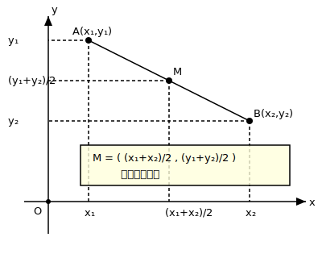

# §3.1 点、线、面

> **前置知识**：无
> **适用年级**：4-7 年级

## 点

### 引入情境（Explore）

在地图上标注一座城市的位置时，我们通常用一个小圆点来表示。这个"点"代表的是一个精确的位置——它没有大小，没有面积，只有位置。

### 概念建立（Build Understanding）

**点**是几何中最基本的概念。点没有大小、没有形状，只表示一个位置。

我们用大写字母来表示点，如点 $A$、点 $B$、点 $C$。

在纸面上画出的"点"其实有一定大小（墨迹总有面积），但在几何学中，我们把点理解为一个没有大小的位置标记。

### 关键总结（Key Takeaways）

- 点是几何最基本的元素，只有位置，没有大小。
- 用大写字母表示点。

---

## 线段、射线与直线

### 引入情境（Explore）

用一根绷紧的线连接桌面上的两颗钉子，你得到的就是一条**线段**。如果这根线的一端固定在钉子上，另一端向远处无限延伸呢？如果两端都无限延伸呢？

### 概念建立（Build Understanding）

**线段**是连接两个点之间的最短路径，它有两个**端点**，有确定的**长度**。线段 $AB$（或 $BA$）表示以 $A$、$B$ 为端点的线段。

**射线**是从一个端点出发、向一个方向无限延伸的部分。射线 $AB$ 表示从点 $A$ 出发经过点 $B$ 方向延伸的射线——注意，射线 $AB$ 与射线 $BA$ 是不同的（端点不同，方向不同）。

**直线**是向两个方向无限延伸的线，没有端点，没有长度（无限长）。经过两点 $A$、$B$ 的直线记作直线 $AB$（或直线 $BA$，两者相同）。

三者的关系：

| | 端点个数 | 是否有限长 | 记法 |
|------|----------|-----------|------|
| 线段 | 2 个 | 有限长 | 线段 $AB$ |
| 射线 | 1 个 | 无限长 | 射线 $AB$（$A$ 为端点）|
| 直线 | 0 个 | 无限长 | 直线 $AB$ |

**基本事实**：经过两个点有且只有一条直线。这通常简述为"两点确定一条直线"。

### 典型例题（Worked Examples）

**例 1.** 如图，平面上有 $A$、$B$、$C$ 三个点（不在同一条直线上）。经过其中每两个点画一条直线，一共能画几条？

**解：** 经过每两个点确定一条直线。三个点中取两个的组合为：直线 $AB$、直线 $AC$、直线 $BC$，共 $3$ 条。

**例 2.** 平面上有 $4$ 个点，其中没有三点共线。经过每两个点画一条直线，一共能画几条？

**解：** 从 $4$ 个点中选 $2$ 个点的组合数为 $\dfrac{4 \times 3}{2} = 6$，所以共能画 $6$ 条直线。

### 关键总结（Key Takeaways）

- 线段有两个端点，有确定长度；射线有一个端点，向一个方向无限延伸；直线无端点，两方向无限延伸。
- 两点确定一条直线。
- 射线的记法有方向性：射线 $AB$ 的端点是 $A$。

### 练一练（Practice）

1. 判断正误：
   - (a) 线段 $AB$ 和线段 $BA$ 是同一条线段。
   - (b) 射线 $AB$ 和射线 $BA$ 是同一条射线。
   - (c) 直线 $AB$ 和直线 $BA$ 是同一条直线。

2. 平面上有 $5$ 个点，其中没有三点共线，经过每两个点画一条直线，共能画多少条？

---

## 两点之间线段最短

### 引入情境（Explore）

从家到学校，你可以走弯弯曲曲的小路，也可以"直线穿过"——哪条路最短？直觉告诉我们，"走直线"最短。

### 概念建立（Build Understanding）

**两点之间线段最短**——这是几何中的一条基本事实（公理）。

连接两点的线段的长度，叫做这两点之间的**距离**。例如，$A$、$B$ 两点之间的距离就是线段 $AB$ 的长度。

这条性质虽然简单，却非常重要。后面学习的"垂线段最短"（§3.3）、三角形的三边关系（§3.4）等，都可以追溯到这条基本事实。

### 关键总结（Key Takeaways）

- 两点之间，线段最短。
- 两点之间的距离 = 连接两点的线段的长度。

---

## 线段的中点

### 引入情境（Explore）

一根 $20$ 厘米长的彩带，从正中间剪一刀，每段多长？中间那个剪切的位置，就是这条线段的**中点**。

### 概念建立（Build Understanding）

如果点 $M$ 在线段 $AB$ 上，且 $AM = MB$，则 $M$ 是线段 $AB$ 的**中点**。

此时 $AM = MB = \dfrac{1}{2} AB$，也可以写成 $AB = 2 \cdot AM = 2 \cdot MB$。

### 典型例题（Worked Examples）

**例 1.** 已知线段 $AB = 10$ cm，$M$ 是 $AB$ 的中点，求 $AM$ 的长。

**解：** 因为 $M$ 是 $AB$ 的中点，所以 $AM = \dfrac{1}{2} AB = \dfrac{1}{2} \times 10 = 5$ cm。

**例 2.** 已知线段 $AB = 8$ cm，$C$ 是 $AB$ 的中点，$D$ 是 $AC$ 的中点，求 $DB$ 的长。

**解：**
因为 $C$ 是 $AB$ 的中点，所以 $AC = \dfrac{1}{2} AB = 4$ cm。

因为 $D$ 是 $AC$ 的中点，所以 $AD = \dfrac{1}{2} AC = 2$ cm。

所以 $DB = AB - AD = 8 - 2 = 6$ cm。

### 关键总结（Key Takeaways）

- 线段的中点把线段分成相等的两段。
- $M$ 是 $AB$ 的中点 $\Longleftrightarrow$ $AM = MB = \dfrac{1}{2}AB$。

### 练一练（Practice）

3. 已知线段 $AB = 12$ cm，$M$ 是 $AB$ 的中点，$N$ 是 $MB$ 的中点，求 $AN$ 的长。

4. 线段 $AB$ 上有一点 $C$，使得 $AC = 3$ cm，$CB = 5$ cm。$M$ 是 $AB$ 的中点，求 $MC$ 的长。

---

## 面的初步概念

### 引入情境（Explore）

桌面、黑板面、湖面——这些都是我们生活中常见的"面"。和"点"与"线"一样，数学中的"面"也是一个理想化的概念。

### 概念建立（Build Understanding）

**面**是平展的、没有厚度的、向各个方向无限延伸的平面。我们通常讨论的是**平面**（flat surface）。

生活中的桌面、地面都是平面的一部分——它们有边界、有大小，而几何学中的平面是无限大的。

平面的基本性质：
- 经过不在同一条直线上的三个点，有且只有一个平面（三点确定一个平面）。
- 如果一条直线上有两个点在一个平面内，那么这条直线上所有的点都在这个平面内。

> 在初中阶段，我们主要研究**平面几何**——所有图形都在同一个平面内。立体几何的系统学习将在高中展开。

### 关键总结（Key Takeaways）

- 平面是无限延展的、没有厚度的平展面。
- 不在同一直线上的三个点确定一个平面。
- 初中几何主要研究平面上的图形。

### 练一练（Practice）

5. 下列说法正确的是（　）
   - A. 直线是线段的一部分
   - B. 线段是直线的一部分
   - C. 射线是直线的一部分
   - D. 直线是射线的一部分

6. 思考题：平面上有 $n$ 个点，其中没有三点共线，经过每两个点画一条直线，共能画多少条？试写出关于 $n$ 的表达式。

---

## 参考答案

1.
   - (a) 正确。线段 $AB$ 和 $BA$ 表示同一条线段。
   - (b) 错误。射线 $AB$ 的端点是 $A$，射线 $BA$ 的端点是 $B$，方向不同。
   - (c) 正确。直线 $AB$ 和 $BA$ 表示同一条直线。

2. 从 $5$ 个点中选 $2$ 个：$\dfrac{5 \times 4}{2} = 10$ 条。

3. $M$ 是 $AB$ 中点，所以 $MB = 6$ cm。$N$ 是 $MB$ 中点，所以 $MN = 3$ cm。$AN = AM + MN = 6 + 3 = 9$ cm。

4. $AB = AC + CB = 3 + 5 = 8$ cm。$M$ 是 $AB$ 中点，$AM = 4$ cm。$MC = AM - AC = 4 - 3 = 1$ cm。

5. 选 B 和 C。线段是直线的一部分（有限的一段），射线也是直线的一部分（从一个点向一个方向的部分）。

6. $\dfrac{n(n-1)}{2}$ 条。从 $n$ 个点中选 $2$ 个点的组合数。
