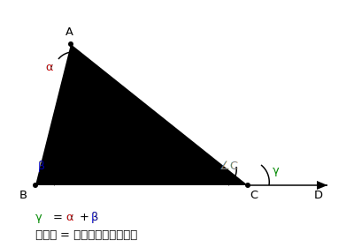

# §3.2 角

> **前置知识**：§3.1
> **适用年级**：4-7 年级

## 角的概念与表示

### 引入情境（Explore）

把一把折扇慢慢展开——两根扇骨从完全合拢到完全张开，它们之间形成的"张口"就是一个**角**。张开得越大，角越大。

### 概念建立（Build Understanding）

**角**是从同一个点出发的两条射线所组成的图形。这个公共端点叫做**顶点**，两条射线叫做角的**两条边**。

角的表示方法有三种：
1. 用三个字母表示： $\angle AOB$ （ $O$ 是顶点，写在中间）
2. 用一个字母表示： $\angle O$ （当顶点处只有一个角时）
3. 用数字编号： $\angle 1$ 、 $\angle 2$ （图中标注角的编号时使用）

### 关键总结（Key Takeaways）

- 角由一个顶点和两条边（射线）组成。
- 三字母表示法中，顶点字母写在中间。

---

## 角的度量

### 引入情境（Explore）

"这个角有多大？"要回答这个问题，我们需要一个度量单位。把一个圆周等分成 $360$ 份，每一份对应的角就是 $1°$ （一度）。

### 概念建立（Build Understanding）

角的度量单位是**度**（°）。将一个周角（完整转一圈）等分为 $360$ 份，每份为 $1°$ 。

更精细的度量：
- $1°= 60'$ （ $1$ 度 $= 60$ 分）
- $1' = 60''$ （ $1$ 分 $= 60$ 秒）

例如， $30°15'20''$ 读作" $30$ 度 $15$ 分 $20$ 秒"。

测量角的工具是**量角器**。使用量角器时：
1. 将量角器的中心对准角的顶点
2. $0°$ 刻度线与角的一条边重合
3. 另一条边所对的刻度就是角的度数

### 典型例题（Worked Examples）

**例 1.** 将 $1.45°$ 化为度、分、秒。

**解：**
$1.45° = 1° + 0.45°$

$0.45° = 0.45 \times 60' = 27'$

所以 $1.45° = 1°27'$ 。

**例 2.** 将 $25°30'36''$ 化为度（用小数表示）。

**解：**
$36'' = \dfrac{36}{60}' = 0.6'$

$30'36'' = 30.6' = \dfrac{30.6}{60}° = 0.51°$

所以 $25°30'36'' = 25.51°$ 。

### 关键总结（Key Takeaways）

- $1$ 周角 $= 360°$ ， $1° = 60'$ ， $1' = 60''$ 。
- 度、分、秒之间的换算是 $60$ 进制。

### 练一练（Practice）

1. 将 $2.35°$ 化为度、分、秒。
2. 将 $45°18'$ 化为度（用小数表示）。

---

## 角的分类

### 引入情境（Explore）

生活中的角形形色色：书本的角是"方方正正"的直角，时钟指针在不同时刻形成大小不一的角。根据角的大小，我们可以把角分成几类。

### 概念建立（Build Understanding）

按照角的度数大小，角可以分为以下几类：

| 角的类型 | 范围 | 说明 |
|----------|------|------|
| 锐角 | $0° < \alpha < 90°$ | 比直角小 |
| 直角 | $\alpha = 90°$ | 方方正正的角 |
| 钝角 | $90° < \alpha < 180°$ | 比直角大，比平角小 |
| 平角 | $\alpha = 180°$ | 两条边在同一直线上，方向相反 |
| 周角 | $\alpha = 360°$ | 完整转一圈 |

直角在图形中用一个小正方形标记来表示。

### 典型例题（Worked Examples）

**例 1.** 时钟在 $3$ 点整时，时针与分针所成的角是什么角？ $4$ 点整呢？

**解：**
$3$ 点整：分针指向 $12$ ，时针指向 $3$ 。时针走过了 $\dfrac{3}{12}$ 个圆周，即 $\dfrac{3}{12} \times 360° = 90°$ 。所以所成的角是**直角**。

$4$ 点整：时针走过了 $\dfrac{4}{12} \times 360° = 120°$ 。因为 $90° < 120° < 180°$ ，所以所成的角是**钝角**。

### 关键总结（Key Takeaways）

- 角按大小分为锐角、直角、钝角、平角、周角。
- 直角 $= 90°$ ，平角 $= 180°$ ，周角 $= 360°$ 。
- 直角用小正方形标记。

### 练一练（Practice）

3. 时钟在 $6$ 点整时，时针和分针形成什么角？在 $2$ 点整呢？
4. 一个角是 $135°$ ，它属于哪类角？

---

## 互补与互余

### 引入情境（Explore）

一块长方形木板从一个顶点处锯开，分成了两个角。如果锯出来的一个角是 $35°$ ，另一个角是多少？它们之间有什么关系？

长方形的角是 $90°$ ，所以另一个角是 $90° - 35° = 55°$ 。这两个角之和恰好等于 $90°$ 。

### 概念建立（Build Understanding）

**互余**：如果两个角的和等于 $90°$ ，则这两个角**互为余角**（互余）。

$$\angle \alpha + \angle \beta = 90° \implies \angle \alpha \text{ 与 } \angle \beta \text{ 互余}$$

**互补**：如果两个角的和等于 $180°$ ，则这两个角**互为补角**（互补）。

$$\angle \alpha + \angle \beta = 180° \implies \angle \alpha \text{ 与 } \angle \beta \text{ 互补}$$

重要性质：
- **同一个角的余角相等**：如果 $\angle 1$ 和 $\angle 2$ 都是 $\angle 3$ 的余角，则 $\angle 1 = \angle 2$ 。
- **同一个角的补角相等**：如果 $\angle 1$ 和 $\angle 2$ 都是 $\angle 3$ 的补角，则 $\angle 1 = \angle 2$ 。

> 互余和互补是两个角之间的关系，不要求这两个角有公共顶点或相邻。

### 典型例题（Worked Examples）

**例 1.** 一个角的余角是 $52°$ ，求这个角及其补角。

**解：**
设这个角为 $\angle \alpha$ 。

因为 $\angle \alpha$ 与 $52°$ 互余，所以 $\angle \alpha + 52° = 90°$ ，解得 $\angle \alpha = 38°$ 。

$\angle \alpha$ 的补角为 $180° - 38° = 142°$ 。

**例 2.** 一个角的补角是它的余角的 $3$ 倍，求这个角。

**解：**
设这个角为 $\angle \alpha$ 。

余角为 $90° - \alpha$ ，补角为 $180° - \alpha$ 。

由题意： $180° - \alpha = 3(90° - \alpha)$

$180° - \alpha = 270° - 3\alpha$

$2\alpha = 90°$

$\alpha = 45°$

**例 3.** 已知 $\angle 1$ 与 $\angle 2$ 互补，且 $\angle 1 = 5\angle 2$ ，求 $\angle 1$ 和 $\angle 2$ 。

**解：**
因为 $\angle 1 + \angle 2 = 180°$ ，且 $\angle 1 = 5\angle 2$ ，

所以 $5\angle 2 + \angle 2 = 180°$ ，即 $6\angle 2 = 180°$ 。

解得 $\angle 2 = 30°$ ， $\angle 1 = 150°$ 。

### 关键总结（Key Takeaways）

- 互余：两角之和 $= 90°$ ；互补：两角之和 $= 180°$ 。
- 同角（或等角）的余角相等，同角（或等角）的补角相等。

### 练一练（Practice）

5. 一个角是 $67°$ ，它的余角和补角分别是多少？
6. 一个角的补角比它的余角大多少？（对任意角成立吗？）
7. 已知 $\angle A$ 与 $\angle B$ 互余， $\angle A = 2\angle B + 12°$ ，求 $\angle A$ 和 $\angle B$ 。

---

## 对顶角

### 引入情境（Explore）

两条直线相交，会形成四个角。用量角器量一量——你发现了什么？对面的两个角总是相等的！

### 概念建立（Build Understanding）

两条直线相交，形成两对**对顶角**。对顶角是指：两个角的顶点相同，且每个角的两条边分别是另一个角的两条边的反向延长线。

如图，直线 $AB$ 和直线 $CD$ 相交于点 $O$ ，则 $\angle 1$ 和 $\angle 3$ 是对顶角， $\angle 2$ 和 $\angle 4$ 是对顶角。

**对顶角相等**。

推理过程：
因为 $\angle 1$ 与 $\angle 2$ 互补（它们组成一个平角），所以 $\angle 1 = 180° - \angle 2$ 。
又因为 $\angle 3$ 与 $\angle 2$ 互补，所以 $\angle 3 = 180° - \angle 2$ 。
因此 $\angle 1 = \angle 3$ 。

同理可得 $\angle 2 = \angle 4$ 。

注意：相邻的两个角互补（ $\angle 1 + \angle 2 = 180°$ ），而不是相等。

### 典型例题（Worked Examples）

**例 1.** 两条直线相交，其中一个角是 $55°$ ，求其他三个角的度数。

**解：**
设四个角依次为 $\angle 1 = 55°$ ， $\angle 2$ ， $\angle 3$ ， $\angle 4$ （按顺时针排列）。

$\angle 2 = 180° - 55° = 125°$ （ $\angle 1$ 与 $\angle 2$ 互补）

$\angle 3 = \angle 1 = 55°$ （对顶角相等）

$\angle 4 = \angle 2 = 125°$ （对顶角相等）

**例 2.** 两条直线相交，其中一对对顶角的和为 $100°$ ，求四个角的度数。

**解：**
设这对对顶角各为 $\alpha$ ，则 $2\alpha = 100°$ ， $\alpha = 50°$ 。

另一对对顶角各为 $180° - 50° = 130°$ 。

所以四个角分别为 $50°$ 、 $130°$ 、 $50°$ 、 $130°$ 。

**例 3.** 如图，三条直线两两相交于同一点 $O$ ， $\angle 1 = 40°$ ， $\angle 2 = 90°$ ，求 $\angle 3$ 的度数。

**解：**
因为 $\angle 1$ 、 $\angle 2$ 、 $\angle 3$ 在一条直线的同侧，组成一个平角，

所以 $\angle 1 + \angle 2 + \angle 3 = 180°$ 。

$40° + 90° + \angle 3 = 180°$

$\angle 3 = 50°$

### 关键总结（Key Takeaways）

- 两条直线相交形成两对对顶角。
- 对顶角相等。
- 相邻角互补。

### 练一练（Practice）

8. 两条直线相交，其中一个角是 $72°$ ，求其他三个角。
9. 两条直线相交，已知两个相邻角的差是 $40°$ ，求四个角的度数。
10. 三条直线交于一点，其中一个角是 $46°$ ，与它相邻的一个角是 $72°$ ，求其余各角。

---

## 参考答案

1. $2.35° = 2°21'$ （ $0.35° = 0.35 \times 60' = 21'$ ）。

2. $45°18' = 45° + \dfrac{18}{60}° = 45.3°$ 。

3. $6$ 点整：时针和分针形成平角（ $180°$ ）。 $2$ 点整： $\dfrac{2}{12} \times 360° = 60°$ ，是锐角。

4. $135°$ ，因为 $90° < 135° < 180°$ ，属于钝角。

5. 余角： $90° - 67° = 23°$ ；补角： $180° - 67° = 113°$ 。

6. 设角为 $\alpha$ ，补角为 $180° - \alpha$ ，余角为 $90° - \alpha$ 。差 $= (180° - \alpha) - (90° - \alpha) = 90°$ 。对任意角（有余角的前提下，即 $\alpha < 90°$ ），补角总比余角大 $90°$ 。

7. 由互余： $\angle A + \angle B = 90°$ 。由 $\angle A = 2\angle B + 12°$ ，代入得 $2\angle B + 12° + \angle B = 90°$ ， $3\angle B = 78°$ ， $\angle B = 26°$ ， $\angle A = 64°$ 。

8. 其他三个角分别为 $108°$ 、 $72°$ 、 $108°$ 。

9. 设较小角为 $\alpha$ ，则相邻角为 $\alpha + 40°$ 。因为互补： $\alpha + (\alpha + 40°) = 180°$ ， $\alpha = 70°$ 。四个角为 $70°$ 、 $110°$ 、 $70°$ 、 $110°$ 。

10. 设六个角按顺时针为 $\angle 1 = 46°$ ， $\angle 2 = 72°$ ， $\angle 3$ ， $\angle 4$ ， $\angle 5$ ， $\angle 6$ 。
    $\angle 3 = 180° - 46° - 72° = 62°$ （三个角组成平角）。
    由对顶角： $\angle 4 = \angle 1 = 46°$ ， $\angle 5 = \angle 2 = 72°$ ， $\angle 6 = \angle 3 = 62°$ 。
