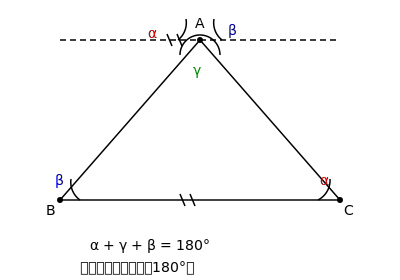
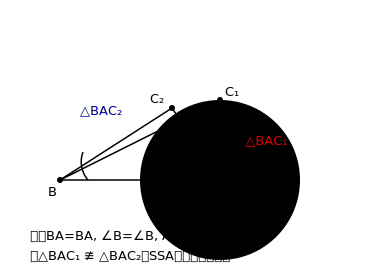
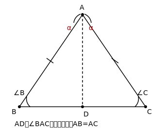

# §3.4 三角形

> **前置知识**：§3.2, §3.3
> **适用年级**：7-8 年级

## 三角形的基本概念

### 引入情境（Explore）

自行车的车架是三角形的——为什么不做成四边形？试着用三根木条钉成一个三角形框架，再用四根木条钉成四边形框架，分别推一推。你会发现三角形推不动，而四边形一推就变形了。这就是三角形的**稳定性**。

### 概念建立（Build Understanding）

由三条线段首尾依次相连围成的图形叫做**三角形**。三角形 $ABC$ 记作 $\triangle ABC$。

三角形的基本要素：
- **顶点**：$A$、$B$、$C$
- **边**：$AB$、$BC$、$AC$（也常用小写字母 $a$、$b$、$c$ 表示对边，其中 $a = BC$、$b = AC$、$c = AB$）
- **角**：$\angle A$、$\angle B$、$\angle C$（即 $\angle BAC$、$\angle ABC$、$\angle ACB$）

**三角形的分类**

按角分类：
| 类型 | 条件 |
|------|------|
| 锐角三角形 | 三个角都是锐角 |
| 直角三角形 | 有一个角是直角 |
| 钝角三角形 | 有一个角是钝角 |

按边分类：
| 类型 | 条件 |
|------|------|
| 不等边三角形 | 三条边都不相等 |
| 等腰三角形 | 至少有两条边相等 |
| 等边三角形 | 三条边都相等 |

**三角形的内角和**

$\triangle ABC$ 的三个内角之和等于 $180°$：

$$\angle A + \angle B + \angle C = 180°$$

推理过程（参见图 assets/03-geometry/triangle-angle-sum.svg）：

过顶点 $A$ 作直线 $DE \parallel BC$。

因为 $DE \parallel BC$，所以 $\angle DAB = \angle B$（内错角相等），$\angle EAC = \angle C$（内错角相等）。

因为 $\angle DAB + \angle BAC + \angle EAC = 180°$（平角），

所以 $\angle B + \angle A + \angle C = 180°$。

### 典型例题（Worked Examples）

**例 1.** $\triangle ABC$ 中，$\angle A = 50°$，$\angle B = 70°$，求 $\angle C$。

**解：**
$\angle C = 180° - \angle A - \angle B = 180° - 50° - 70° = 60°$。

**例 2.** $\triangle ABC$ 中，$\angle A : \angle B : \angle C = 2 : 3 : 4$，求三个角。

**解：**
设 $\angle A = 2k$，$\angle B = 3k$，$\angle C = 4k$。

$2k + 3k + 4k = 180°$，$9k = 180°$，$k = 20°$。

所以 $\angle A = 40°$，$\angle B = 60°$，$\angle C = 80°$。

**例 3.** 直角三角形中，一个锐角为 $35°$，求另一个锐角。

**解：**
设直角为 $\angle C = 90°$，已知锐角 $\angle A = 35°$。

$\angle B = 180° - 90° - 35° = 55°$。

**例 4.** $\triangle ABC$ 中，$\angle A = 2\angle B = 3\angle C$，求三个角。

**解：**
设 $\angle C = x$，则 $\angle A = 3x$，由 $\angle A = 2\angle B$ 得 $\angle B = \dfrac{3x}{2}$。

$3x + \dfrac{3x}{2} + x = 180°$

$\dfrac{6x + 3x + 2x}{2} = 180°$

$\dfrac{11x}{2} = 180°$，$x = \dfrac{360°}{11} \approx 32.7°$。

精确值：$\angle C = \dfrac{360°}{11}$，$\angle B = \dfrac{540°}{11}$，$\angle A = \dfrac{1080°}{11}$。

### 关键总结（Key Takeaways）

- 三角形的内角和为 $180°$。
- 直角三角形的两个锐角互余。
- 三角形具有稳定性。

### 练一练（Practice）

1. $\triangle ABC$ 中，$\angle A = 48°$，$\angle C = 65°$，求 $\angle B$。
2. 一个等腰三角形的顶角是 $40°$，求两个底角。

---

## 三角形的三边关系

### 引入情境（Explore）

给你三根木棒，长度分别是 $3$ cm、$4$ cm、$5$ cm，能搭成三角形吗？如果换成 $1$ cm、$2$ cm、$5$ cm呢？试一试就知道——第二组搭不成！两条短边加起来还不够长，无法"够到"第三条边的两端。

### 概念建立（Build Understanding）

**三角形的三边关系**：三角形任意两边之和大于第三边。

$$a + b > c, \quad a + c > b, \quad b + c > a$$

等价地，也可以说：三角形任意两边之差小于第三边。

> 实际判断时，只需检验**两条较短边之和是否大于最长边**即可。如果最短的两边之和都大于最长边，那么其他两个不等式自然成立。

### 典型例题（Worked Examples）

**例 1.** 判断下列各组线段能否构成三角形：(a) $3, 4, 8$；(b) $5, 6, 10$；(c) $3, 3, 5$。

**解：**
(a) $3 + 4 = 7 < 8$，不能构成三角形。

(b) $5 + 6 = 11 > 10$，能构成三角形。

(c) $3 + 3 = 6 > 5$，能构成三角形。

**例 2.** 三角形的两边长分别为 $3$ cm 和 $7$ cm，第三边的长度 $x$ 的取值范围是什么？

**解：**
由三边关系：$7 - 3 < x < 7 + 3$，即 $4 < x < 10$。

**例 3.** 等腰三角形的两边长分别为 $3$ 和 $7$，求周长。

**解：**
等腰三角形有两条边相等。

情况一：两腰为 $3$，底边为 $7$。检验：$3 + 3 = 6 < 7$，不满足三边关系，不能构成三角形。

情况二：两腰为 $7$，底边为 $3$。检验：$7 + 3 = 10 > 7$，满足三边关系。

所以周长 $= 7 + 7 + 3 = 17$。

### 关键总结（Key Takeaways）

- 三角形任意两边之和大于第三边。
- 判断时只需检验两短边之和 $>$ 最长边。
- 已知两边求第三边范围：两边之差 $<$ 第三边 $<$ 两边之和。

### 练一练（Practice）

3. 三角形的两边长分别为 $5$ 和 $9$，第三边为整数，求第三边的所有可能值。
4. 等腰三角形的两边长为 $4$ 和 $9$，求周长。

---

## 全等三角形

### 引入情境（Explore）

冲压模具生产出的零件，每一个的形状和大小都完全一样——它们是"全等"的。两个三角形，如果能完全重合，我们就说它们全等。

### 概念建立（Build Understanding）

如果两个三角形的形状和大小完全相同（能够完全重合），则称这两个三角形**全等**，记作 $\triangle ABC \cong \triangle DEF$。

全等三角形的对应关系：
- **对应顶点**：$A \leftrightarrow D$，$B \leftrightarrow E$，$C \leftrightarrow F$
- **对应边相等**：$AB = DE$，$BC = EF$，$AC = DF$
- **对应角相等**：$\angle A = \angle D$，$\angle B = \angle E$，$\angle C = \angle F$

> 书写全等时，对应顶点要写在对应位置上。$\triangle ABC \cong \triangle DEF$ 说明 $A$ 对应 $D$、$B$ 对应 $E$、$C$ 对应 $F$。

**全等三角形的判定条件**

要判断两个三角形全等，不需要知道全部六个元素（三边三角），只需要满足以下条件之一：

| 判定方法 | 条件 | 简记 |
|----------|------|------|
| 边边边 | 三条边分别相等 | SSS |
| 边角边 | 两边及其夹角分别相等 | SAS |
| 角边角 | 两角及其夹边分别相等 | ASA |
| 角角边 | 两角及其中一角的对边分别相等 | AAS |
| 斜边直角边 | 直角三角形的斜边和一条直角边分别相等 | HL |

> **注意**：**SSA（边边角）不能判定全等！** 已知两边和非夹角相等时，可能存在两种不同的三角形。这是一个常见的错误，务必记住。

### 典型例题（Worked Examples）

**例 1.** 如图，$AB = DC$，$\angle ABD = \angle DCB$。证明 $\triangle ABD \cong \triangle DCB$。

**证明：**
在 $\triangle ABD$ 和 $\triangle DCB$ 中：

$$\begin{aligned}
AB &= DC \quad (\text{已知}) \\
\angle ABD &= \angle DCB \quad (\text{已知}) \\
BD &= CB \quad (\text{公共边})
\end{aligned}$$

所以 $\triangle ABD \cong \triangle DCB$（SAS）。

**例 2.** 如图，$\angle A = \angle D$，$\angle B = \angle E$，$BC = EF$。证明 $\triangle ABC \cong \triangle DEF$。

**证明：**
在 $\triangle ABC$ 和 $\triangle DEF$ 中：

$$\begin{aligned}
\angle B &= \angle E \quad (\text{已知}) \\
BC &= EF \quad (\text{已知}) \\
\angle A &= \angle D \quad (\text{已知})
\end{aligned}$$

因为 $\angle B = \angle E$，$BC = EF$，又 $\angle A = \angle D$，

这里 $BC$ 是 $\angle B$ 的一条边，$\angle A$ 是 $\triangle ABC$ 的另一个角，

所以 $\triangle ABC \cong \triangle DEF$（AAS）。

**例 3.** 如图，$\angle ACB = \angle ADB = 90°$，$AC = AD$。证明 $\triangle ACB \cong \triangle ADB$。

**证明：**
在直角 $\triangle ACB$ 和直角 $\triangle ADB$ 中：

$$\begin{aligned}
\angle ACB &= \angle ADB = 90° \quad (\text{已知}) \\
AB &= AB \quad (\text{公共斜边}) \\
AC &= AD \quad (\text{已知})
\end{aligned}$$

所以 $\triangle ACB \cong \triangle ADB$（HL）。

### 关键总结（Key Takeaways）

- 全等三角形对应边相等，对应角相等。
- 五种判定方法：SSS、SAS、ASA、AAS、HL。
- SSA 不能判定全等。
- 写全等时对应顶点写在对应位置。

### 练一练（Practice）

5. 如图，$AB = CD$，$AB \parallel CD$。证明 $\triangle ABO \cong \triangle CDO$（$O$ 是 $AC$ 与 $BD$ 的交点）。
6. 如图，$\angle 1 = \angle 2$，$\angle 3 = \angle 4$，$AD = BC$。证明 $\triangle ADB \cong \triangle BCA$。
7. 如图，$RT\triangle ABC$ 和 $RT\triangle DEF$ 中，$\angle C = \angle F = 90°$，$AB = DE$，$BC = EF$。证明 $\triangle ABC \cong \triangle DEF$。

---

## 等腰三角形与等边三角形

### 引入情境（Explore）

用一张纸对折后沿斜线剪一刀，展开后得到的三角形两边相等——这就是等腰三角形。如果剪切角度恰当，还能得到三边都相等的等边三角形。这些特殊三角形有哪些特别的性质？

### 概念建立（Build Understanding）

**等腰三角形**：有两条边相等的三角形。相等的两条边叫做**腰**，第三条边叫做**底边**，两腰所夹的角叫做**顶角**，底边上的两个角叫做**底角**。

**等腰三角形的性质**：

1. **等边对等角**（等腰三角形的两个底角相等）。
2. **"三线合一"**：等腰三角形的顶角平分线、底边上的中线、底边上的高互相重合。

**等腰三角形的判定**：

**等角对等边**：如果一个三角形有两个角相等，则这两个角所对的边也相等（该三角形是等腰三角形）。

**等边三角形**：三条边都相等的三角形。等边三角形是等腰三角形的特殊情况。

等边三角形的性质：
- 三个角都等于 $60°$。
- 等边三角形也满足"三线合一"。

等边三角形的判定：
- 三边相等的三角形是等边三角形。
- 三个角都相等的三角形是等边三角形。
- 有一个角是 $60°$ 的等腰三角形是等边三角形。

### 典型例题（Worked Examples）

**例 1.** 等腰三角形的一个角是 $80°$，求其他两个角。

**解：**
情况一：$80°$ 是顶角。两底角 $= \dfrac{180° - 80°}{2} = 50°$。

情况二：$80°$ 是底角。另一底角也是 $80°$，顶角 $= 180° - 80° - 80° = 20°$。

所以其他两个角为 $50°, 50°$ 或 $80°, 20°$。

**例 2.** 等腰三角形的一个角是 $120°$，求其他两个角。

**解：**
$120°$ 只能是顶角（因为底角相等，若两个底角都是 $120°$，角度之和已超过 $180°$）。

两底角 $= \dfrac{180° - 120°}{2} = 30°$。

**例 3.** 如图，$\triangle ABC$ 中，$AB = AC$，$BD$ 是 $\angle ABC$ 的角平分线，$\angle A = 40°$。求 $\angle BDC$。

**解：**
因为 $AB = AC$，$\angle A = 40°$，

所以 $\angle ABC = \angle ACB = \dfrac{180° - 40°}{2} = 70°$。

因为 $BD$ 平分 $\angle ABC$，

所以 $\angle ABD = \dfrac{70°}{2} = 35°$。

在 $\triangle BDC$ 中，$\angle BDC = 180° - \angle DBC - \angle BCD = 180° - 35° - 70° = 75°$。

**例 4.** 证明：等边三角形的每个角都是 $60°$。

**证明：**
设 $\triangle ABC$ 是等边三角形，$AB = BC = CA$。

因为 $AB = AC$，所以 $\angle B = \angle C$（等边对等角）。

因为 $AB = BC$，所以 $\angle A = \angle C$（等边对等角）。

所以 $\angle A = \angle B = \angle C$。

又因为 $\angle A + \angle B + \angle C = 180°$，所以 $3\angle A = 180°$，$\angle A = 60°$。

因此等边三角形的每个角都是 $60°$。

### 关键总结（Key Takeaways）

- 等腰三角形：等边对等角，等角对等边。
- 等腰三角形有"三线合一"的性质。
- 等边三角形三个角都是 $60°$。
- 等腰三角形的角分两种情况讨论（给定角是顶角还是底角）。

### 练一练（Practice）

8. 等腰三角形的一个角是 $50°$，求其他两个角（考虑所有情况）。
9. $\triangle ABC$ 中，$AB = AC$，$D$ 是 $BC$ 的中点。证明 $AD \perp BC$。
10. 已知等边 $\triangle ABC$ 的周长为 $18$ cm，求边长。

---

## 相似三角形

### 引入情境（Explore）

把一张照片放大或缩小后，照片中的人物比例不变——长宽比是一样的。这就是"相似"的直观含义：形状相同，大小可以不同。

### 概念建立（Build Understanding）

如果两个三角形的对应角相等、对应边成比例，则这两个三角形**相似**，记作 $\triangle ABC \sim \triangle DEF$。

对应边的比值叫做**相似比**（或比例系数）。若 $\triangle ABC \sim \triangle DEF$，相似比为 $k$，则：

$$\frac{AB}{DE} = \frac{BC}{EF} = \frac{AC}{DF} = k$$

> 全等是相似的特殊情况——相似比 $k = 1$ 时，就是全等。

**相似三角形的判定条件**：

| 判定方法 | 条件 |
|----------|------|
| AA | 两组对应角分别相等 |
| SAS 相似 | 两组对应边成比例，且夹角相等 |
| SSS 相似 | 三组对应边分别成比例 |

> AA 判定最常用：只需两对角相等（第三对角自动相等，因为内角和为 $180°$）。

**相似三角形的性质**：
- 对应角相等。
- 对应边成比例。
- 对应高的比、对应中线的比、对应角平分线的比都等于相似比。
- 周长的比等于相似比。
- 面积的比等于相似比的平方。

### 典型例题（Worked Examples）

**例 1.** 如图，$DE \parallel BC$，$AD = 3$，$DB = 6$，$DE = 4$。求 $BC$ 的长。

**解：**
因为 $DE \parallel BC$，

所以 $\triangle ADE \sim \triangle ABC$（AA：$\angle ADE = \angle B$，$\angle A = \angle A$）。

相似比为 $\dfrac{AD}{AB} = \dfrac{3}{3 + 6} = \dfrac{3}{9} = \dfrac{1}{3}$。

所以 $\dfrac{DE}{BC} = \dfrac{1}{3}$，$BC = 3 \times DE = 3 \times 4 = 12$。

**例 2.** $\triangle ABC$ 中，$D$ 是 $AB$ 上的点，$E$ 是 $AC$ 上的点。$\dfrac{AD}{AB} = \dfrac{AE}{AC} = \dfrac{2}{5}$，$\angle A = \angle A$。证明 $\triangle ADE \sim \triangle ABC$。

**证明：**
在 $\triangle ADE$ 和 $\triangle ABC$ 中：

$\dfrac{AD}{AB} = \dfrac{AE}{AC} = \dfrac{2}{5}$（已知），$\angle A = \angle A$（公共角）。

所以 $\triangle ADE \sim \triangle ABC$（SAS 相似）。

**例 3.** $\triangle ABC \sim \triangle DEF$，相似比为 $2:3$。$\triangle ABC$ 的周长为 $24$ cm，面积为 $32$ cm$^2$。求 $\triangle DEF$ 的周长和面积。

**解：**
周长比 $=$ 相似比 $= 2:3$。

$\triangle DEF$ 的周长 $= 24 \times \dfrac{3}{2} = 36$ cm。

面积比 $=$ 相似比的平方 $= 4:9$。

$\triangle DEF$ 的面积 $= 32 \times \dfrac{9}{4} = 72$ cm$^2$。

### 关键总结（Key Takeaways）

- 相似三角形：对应角相等，对应边成比例。
- 三种判定方法：AA、SAS 相似、SSS 相似。
- 周长比 $=$ 相似比；面积比 $=$ 相似比的平方。

### 练一练（Practice）

11. 如图，$DE \parallel BC$，$AD = 4$，$AB = 10$，$BC = 15$。求 $DE$ 的长。
12. $\triangle ABC \sim \triangle DEF$，$AB = 6$，$DE = 9$，$\triangle ABC$ 的面积为 $20$。求 $\triangle DEF$ 的面积。
13. 阳光下，一根 $1.5$ m 高的木棒竖直立在地面上，影长 $2$ m。旁边一棵树的影长 $8$ m，求树的高度。

---

## 三角形的中位线

### 引入情境（Explore）

连接三角形两边中点的线段，和第三条边有什么关系？在纸上画一个三角形，找到两边的中点连接起来，量一量这条线段和第三边——你会发现它恰好是第三边的一半，而且和第三边平行！

### 概念建立（Build Understanding）

连接三角形两边中点的线段叫做三角形的**中位线**。

**三角形中位线定理**：三角形的中位线平行于第三边，且等于第三边的一半。

如图，$D$、$E$ 分别是 $AB$、$AC$ 的中点，则 $DE \parallel BC$，且 $DE = \dfrac{1}{2}BC$。

**证明**：
延长 $DE$ 到 $F$，使 $EF = DE$。连接 $CF$。

因为 $AE = EC$（$E$ 是 $AC$ 中点），$DE = EF$（作法），$\angle AED = \angle CEF$（对顶角），

所以 $\triangle ADE \cong \triangle CFE$（SAS）。

所以 $AD = CF$，$\angle ADE = \angle CFE$。

因为 $AD = CF$ 且 $AD = DB$（$D$ 是 $AB$ 中点），所以 $CF = DB$。

因为 $\angle ADE = \angle CFE$，即 $\angle BDF = \angle CFD$，这是截线 $DF$ 所截的内错角，

所以 $BD \parallel CF$。

因为 $BD \parallel CF$ 且 $BD = CF$，所以四边形 $DBCF$ 是平行四边形（一组对边平行且相等）。

所以 $DF \parallel BC$，即 $DE \parallel BC$，且 $DF = BC$。

因为 $DE = \dfrac{1}{2}DF$，所以 $DE = \dfrac{1}{2}BC$。

### 典型例题（Worked Examples）

**例 1.** $\triangle ABC$ 中，$D$、$E$ 分别是 $AB$、$AC$ 的中点，$BC = 10$ cm。求 $DE$ 的长。

**解：**
因为 $D$、$E$ 分别是 $AB$、$AC$ 的中点，所以 $DE$ 是 $\triangle ABC$ 的中位线。

由中位线定理，$DE = \dfrac{1}{2}BC = \dfrac{1}{2} \times 10 = 5$ cm。

**例 2.** $\triangle ABC$ 中，$D$、$E$、$F$ 分别是 $AB$、$BC$、$CA$ 的中点。$\triangle DEF$ 的周长与 $\triangle ABC$ 的周长有什么关系？

**解：**
$DE$ 是 $\triangle ABC$ 的中位线，$DE = \dfrac{1}{2}AC$。

$DF$ 是 $\triangle ABC$ 的中位线，$DF = \dfrac{1}{2}BC$。

$EF$ 是 $\triangle ABC$ 的中位线，$EF = \dfrac{1}{2}AB$。

$\triangle DEF$ 的周长 $= DE + DF + EF = \dfrac{1}{2}(AC + BC + AB) = \dfrac{1}{2} \times \triangle ABC$ 的周长。

**例 3.** 四边形 $ABCD$ 中，$E$、$F$、$G$、$H$ 分别是 $AB$、$BC$、$CD$、$DA$ 的中点。证明 $EFGH$ 是平行四边形。

**证明：**
连接对角线 $AC$。

在 $\triangle ABC$ 中，$E$、$F$ 分别是 $AB$、$BC$ 的中点，所以 $EF \parallel AC$，$EF = \dfrac{1}{2}AC$。

在 $\triangle ACD$ 中，$G$、$H$ 分别是 $CD$、$DA$ 的中点，所以 $HG \parallel AC$，$HG = \dfrac{1}{2}AC$。

因为 $EF \parallel AC$，$HG \parallel AC$，所以 $EF \parallel HG$。

又因为 $EF = HG = \dfrac{1}{2}AC$，

所以四边形 $EFGH$ 是平行四边形（一组对边平行且相等）。

### 关键总结（Key Takeaways）

- 三角形中位线平行于第三边，且等于第三边的一半。
- 三角形三条中位线围成的小三角形的周长是原三角形周长的一半。
- 中位线定理可用于证明线段平行和计算线段长度。

### 练一练（Practice）

14. $\triangle ABC$ 中，$D$、$E$ 分别是 $AB$、$AC$ 的中点，$DE = 7$ cm。求 $BC$ 的长。
15. 梯形 $ABCD$ 中，$AD \parallel BC$，$E$、$F$ 分别是两腰 $AB$、$CD$ 的中点。证明 $EF \parallel BC$，且 $EF = \dfrac{1}{2}(AD + BC)$。（提示：延长 $AF$ 到 $BC$ 的延长线上交于一点 $G$）

---

## 参考答案

1. $\angle B = 180° - 48° - 65° = 67°$。

2. 两个底角 $= \dfrac{180° - 40°}{2} = 70°$。

3. 由三边关系：$9 - 5 < x < 9 + 5$，即 $4 < x < 14$。第三边为整数，所以可能值为 $5, 6, 7, 8, 9, 10, 11, 12, 13$。

4. $4$ 不能做底边（若两腰为 $4$，则 $4 + 4 = 8 < 9$，不满足三边关系）。所以两腰为 $9$，底边为 $4$，周长 $= 9 + 9 + 4 = 22$。

5. 因为 $AB \parallel CD$，所以 $\angle ABO = \angle CDO$（内错角相等），$\angle BAO = \angle DCO$（内错角相等）。又 $AB = CD$（已知）。所以 $\triangle ABO \cong \triangle CDO$（ASA）。

6. 在 $\triangle ADB$ 和 $\triangle BCA$ 中：$AD = BC$（已知），$\angle 1 = \angle 2$（已知），$\angle 3 = \angle 4$（已知）。所以 $\angle 1 + \angle 3 = \angle 2 + \angle 4$，即 $\angle ADB = \angle BCA$。又 $AD = BC$，$AB = BA$（公共边）。所以 $\triangle ADB \cong \triangle BCA$（SAS）。

7. 在 $RT\triangle ABC$ 和 $RT\triangle DEF$ 中，$\angle C = \angle F = 90°$，$AB = DE$（斜边相等），$BC = EF$（直角边相等）。所以 $\triangle ABC \cong \triangle DEF$（HL）。

8. 情况一：$50°$ 是顶角，底角 $= \dfrac{180° - 50°}{2} = 65°$。其他两个角为 $65°, 65°$。
   情况二：$50°$ 是底角，顶角 $= 180° - 50° - 50° = 80°$。其他两个角为 $50°, 80°$。

9. 因为 $AB = AC$，$D$ 是 $BC$ 中点，所以 $BD = DC$。又 $AD = AD$（公共边）。所以 $\triangle ABD \cong \triangle ACD$（SSS）。所以 $\angle ADB = \angle ADC$。因为 $\angle ADB + \angle ADC = 180°$，所以 $\angle ADB = 90°$，即 $AD \perp BC$。

10. 边长 $= 18 \div 3 = 6$ cm。

11. 因为 $DE \parallel BC$，所以 $\triangle ADE \sim \triangle ABC$。$\dfrac{DE}{BC} = \dfrac{AD}{AB} = \dfrac{4}{10} = \dfrac{2}{5}$。$DE = \dfrac{2}{5} \times 15 = 6$。

12. 相似比 $= \dfrac{AB}{DE} = \dfrac{6}{9} = \dfrac{2}{3}$。面积比 $= \left(\dfrac{2}{3}\right)^2 = \dfrac{4}{9}$。$\dfrac{20}{S} = \dfrac{4}{9}$，$S = 45$。

13. 木棒与其影、树与其影分别构成相似的直角三角形（阳光平行）。$\dfrac{1.5}{2} = \dfrac{h}{8}$，$h = \dfrac{1.5 \times 8}{2} = 6$ m。树高 $6$ m。

14. $BC = 2 \times DE = 2 \times 7 = 14$ cm。

15. 延长 $AF$ 交 $BC$ 延长线于 $G$。在 $\triangle ADF$ 和 $\triangle GCF$ 中：$DF = CF$（$F$ 是 $CD$ 中点），$\angle ADF = \angle GCF$（$AD \parallel BG$，内错角），$\angle AFD = \angle GFC$（对顶角）。所以 $\triangle ADF \cong \triangle GCF$（ASA），$AD = GC$。在 $\triangle ABG$ 中，$E$ 是 $AB$ 中点，$F$ 是 $AG$ 中点（因为 $AF = GF$），所以 $EF$ 是 $\triangle ABG$ 的中位线，$EF \parallel BG$，$EF = \dfrac{1}{2}BG = \dfrac{1}{2}(BC + CG) = \dfrac{1}{2}(BC + AD)$。
