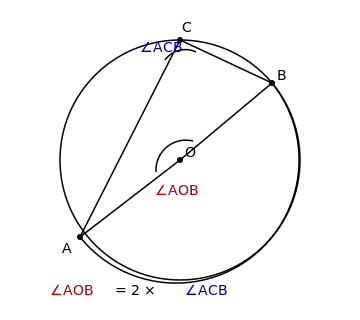

# §3.6 圆

> **前置知识**：§1.8, §3.4
> **适用年级**：9 年级

## 圆的基本概念

### 引入情境（Explore）

往平静的水面丢一块石头，荡开的水波是一圈圈同心圆。把一根绳子的一端固定，另一端绑上一支笔旋转一圈——画出的就是一个圆。所有这些"圆"有一个共同特征：每一点到某个中心的距离都是相等的。

### 概念建立（Build Understanding）

**圆的定义**：平面上到一个定点的距离等于定长的所有点组成的图形叫做**圆**。这个定点叫做**圆心**（记作 $O$ ），定长叫做**半径**（记作 $r$ ）。以 $O$ 为圆心、 $r$ 为半径的圆记作 $\odot O$ 。

基本术语：
| 术语 | 定义 |
|------|------|
| **圆心** $O$ | 到圆上各点距离都相等的点 |
| **半径** $r$ | 圆心到圆上任意一点的线段 |
| **直径** $d$ | 经过圆心的弦， $d = 2r$ |
| **弦** | 连接圆上任意两点的线段 |
| **弧** | 圆上两点之间的部分，分**优弧**（大于半圆的弧）和**劣弧**（小于半圆的弧） |
| **半圆** | 直径所对的弧 |

弧的记法： $\overset{\frown}{AB}$ 表示从 $A$ 到 $B$ 的弧。如果需要区分优弧和劣弧，可加第三个点，如 $\overset{\frown}{ACB}$ 。

**圆的对称性**：
- 圆是**轴对称图形**：任意一条直径所在的直线都是对称轴。
- 圆是**中心对称图形**：圆心是对称中心。

### 关键总结（Key Takeaways）

- 圆心决定位置，半径决定大小。
- 直径是最长的弦， $d = 2r$ 。
- 圆既是轴对称图形又是中心对称图形。

### 练一练（Practice）

1. 一个圆的半径是 $5$ cm，它的直径是多少？通过圆心能画多少条对称轴？

---

## 垂径定理

### 引入情境（Explore）

把一个圆形纸片沿直径对折，折痕上的直径恰好将每条弦（垂直于直径的弦）平分。这背后的规律就是垂径定理。

### 概念建立（Build Understanding）

**垂径定理**：垂直于弦的直径平分该弦，并且平分弦所对的两条弧。

反过来：平分弦（非直径）的直径垂直于该弦。

设 $\odot O$ 中，直径 $AB \perp$ 弦 $CD$ 于点 $M$ ，则 $CM = MD$ ， $\overset{\frown}{BC} = \overset{\frown}{BD}$ （小弧）， $\overset{\frown}{AC} = \overset{\frown}{AD}$ （大弧）。

**证明**：
连接 $OC$ 、 $OD$ 。

因为 $OC = OD = r$ （半径）， $OM = OM$ （公共边）， $\angle OMC = \angle OMD = 90°$ （垂直），

所以 $\triangle OMC \cong \triangle OMD$ （HL）。

所以 $CM = MD$ 。

### 典型例题（Worked Examples）

**例 1.** 圆的半径 $r = 5$ cm，弦 $AB = 8$ cm。求圆心到弦 $AB$ 的距离。

**解：**
设 $O$ 为圆心， $OM \perp AB$ ，垂足 $M$ 。

由垂径定理， $AM = \dfrac{1}{2}AB = 4$ cm。

在直角 $\triangle OMA$ 中， $OM = \sqrt{OA^2 - AM^2} = \sqrt{25 - 16} = 3$ cm。

**例 2.** 圆的直径 $d = 26$ cm，圆心到弦 $AB$ 的距离为 $5$ cm。求弦 $AB$ 的长。

**解：**
$r = 13$ cm， $OM = 5$ cm。

$AM = \sqrt{OA^2 - OM^2} = \sqrt{169 - 25} = \sqrt{144} = 12$ cm。

$AB = 2 \times AM = 24$ cm。

**例 3.** 在 $\odot O$ 中，弦 $AB$ 的长为 $12$ cm，弦 $CD$ 的长为 $16$ cm，半径 $r = 10$ cm。哪条弦离圆心更近？

**解：**
弦 $AB$ 的半长 $= 6$ ，圆心到 $AB$ 的距离 $= \sqrt{100 - 36} = 8$ cm。

弦 $CD$ 的半长 $= 8$ ，圆心到 $CD$ 的距离 $= \sqrt{100 - 64} = 6$ cm。

$CD$ 离圆心更近。一般地，在同圆中，弦越长离圆心越近。

### 关键总结（Key Takeaways）

- 垂径定理：垂直于弦的直径平分弦和弦所对的弧。
- 圆心到弦的距离 $d = \sqrt{r^2 - \left(\dfrac{l}{2}\right)^2}$ ，其中 $l$ 为弦长。
- 同圆中，弦越长，离圆心越近。

### 练一练（Practice）

2. 圆的半径 $r = 10$ cm，弦 $AB = 16$ cm，求圆心到弦 $AB$ 的距离。
3. 圆的半径 $r = 13$ cm，圆心到弦 $AB$ 的距离为 $12$ cm，求弦长。

---

## 圆心角与圆周角

### 引入情境（Explore）

站在一个圆形操场的中心看两根立柱，你看到的角度和站在操场边缘看同样两根立柱的角度不一样。中心看到的角更大，边缘看到的角更小——而且有一个简洁的数量关系。

### 概念建立（Build Understanding）

**圆心角**：顶点在圆心的角叫做圆心角。圆心角的度数等于它所对弧的度数。

**圆周角**：顶点在圆上，且两边都与圆相交的角叫做圆周角。

**圆周角定理**：同弧（或等弧）上的圆周角等于该弧所对的圆心角的一半。

$$\text{圆周角} = \frac{1}{2} \times \text{圆心角}$$

推论：
1. **同弧上的圆周角相等。**
2. **半圆（或直径）所对的圆周角是直角。** 反过来， $90°$ 的圆周角所对的弦是直径。
3. 在同圆中，如果两个圆周角相等，那么它们所对的弧也相等。

### 典型例题（Worked Examples）

**例 1.** 如图， $\odot O$ 中，圆心角 $\angle AOB = 80°$ 。 $C$ 是弧 $AB$ 上的一点（在优弧上）。求 $\angle ACB$ 。

**解：**
$\angle ACB$ 是弧 $AB$ （劣弧）所对的圆周角， $\angle AOB$ 是同弧所对的圆心角。

$\angle ACB = \dfrac{1}{2} \angle AOB = \dfrac{1}{2} \times 80° = 40°$ 。

**例 2.** $AB$ 是 $\odot O$ 的直径， $C$ 是圆上一点（不同于 $A$ 、 $B$ ）。求 $\angle ACB$ 。

**解：**
$AB$ 是直径，即 $\angle AOB = 180°$ （平角）。

$\angle ACB = \dfrac{1}{2} \times 180° = 90°$ 。

所以**直径所对的圆周角是直角**。

**例 3.** 如图， $AB$ 是 $\odot O$ 的直径， $\angle BAC = 35°$ 。求 $\angle ABC$ 。

**解：**
因为 $AB$ 是直径，所以 $\angle ACB = 90°$ 。

$\angle ABC = 180° - \angle ACB - \angle BAC = 180° - 90° - 35° = 55°$ 。

**例 4.** 如图， $\odot O$ 中， $\angle ACB = 50°$ ， $\angle ADB = ?$ （ $C$ 、 $D$ 在弧 $AB$ 的同侧）。

**解：**
因为 $C$ 、 $D$ 在同一条弧上， $\angle ACB$ 和 $\angle ADB$ 是同弧上的圆周角。

所以 $\angle ADB = \angle ACB = 50°$ 。

### 关键总结（Key Takeaways）

- 圆周角 $=$ 同弧圆心角的一半。
- 同弧上的圆周角相等。
- 直径所对的圆周角是直角（反之亦成立）。

### 练一练（Practice）

4. $\odot O$ 中，圆心角 $\angle AOB = 120°$ ，求优弧 $AB$ 上的点 $C$ 所对应的 $\angle ACB$ 。
5. $\odot O$ 中， $\angle ACB = 25°$ ，求圆心角 $\angle AOB$ 。
6. $AB$ 是 $\odot O$ 的直径， $\angle ABD = 58°$ ， $D$ 在圆上。求 $\angle ADB$ 和 $\angle DAB$ 。

---

## 弧长与扇形面积

### 引入情境（Explore）

披萨被切成若干等份，每一份的边缘（弧）有多长？每一份的面积是多少？这就涉及弧长和扇形面积的计算。

### 概念建立（Build Understanding）

**弧长公式**：圆心角为 $n°$ 的弧长为

$$l = \frac{n\pi r}{180}$$

理解：整个圆的周长是 $2\pi r$ ，弧长占周长的比例为 $\dfrac{n}{360}$ ，所以 $l = 2\pi r \times \dfrac{n}{360} = \dfrac{n\pi r}{180}$ 。

**扇形面积公式**：圆心角为 $n°$ 的扇形面积为

$$S = \frac{n\pi r^2}{360}$$

也可以写成： $S = \dfrac{1}{2}lr$ ，其中 $l$ 是弧长。

### 典型例题（Worked Examples）

**例 1.** 半径 $r = 6$ cm 的圆中，圆心角 $n = 60°$ 所对的弧长和扇形面积各是多少？

**解：**
弧长 $l = \dfrac{60\pi \times 6}{180} = \dfrac{360\pi}{180} = 2\pi \approx 6.28$ cm。

扇形面积 $S = \dfrac{60\pi \times 36}{360} = \dfrac{2160\pi}{360} = 6\pi \approx 18.85$ cm $^2$ 。

**例 2.** 一扇形的弧长为 $4\pi$ cm，半径为 $6$ cm。求圆心角。

**解：**
$l = \dfrac{n\pi r}{180}$ ， $4\pi = \dfrac{n\pi \times 6}{180}$ ， $n = \dfrac{4\pi \times 180}{\pi \times 6} = 120°$ 。

**例 3.** 一段弧长为 $3\pi$ cm，圆心角为 $90°$ 。求半径和扇形面积。

**解：**
$l = \dfrac{n\pi r}{180}$ ， $3\pi = \dfrac{90\pi r}{180} = \dfrac{\pi r}{2}$ ， $r = 6$ cm。

$S = \dfrac{1}{2}lr = \dfrac{1}{2} \times 3\pi \times 6 = 9\pi \approx 28.27$ cm $^2$ 。

### 关键总结（Key Takeaways）

- 弧长 $l = \dfrac{n\pi r}{180}$ 。
- 扇形面积 $S = \dfrac{n\pi r^2}{360} = \dfrac{1}{2}lr$ 。
- 圆心角越大，弧越长，扇形面积越大。

### 练一练（Practice）

7. 半径 $r = 10$ cm，圆心角 $n = 72°$ 。求弧长和扇形面积。
8. 扇形的弧长为 $5\pi$ cm，圆心角为 $150°$ ，求半径和面积。

---

## 直线与圆的位置关系

### 引入情境（Explore）

看日出时，太阳从海平面一点点升起——先是一个点接触海平面（相切），然后一部分在海平面以下、一部分在上面（相交），继续升高后完全离开海平面（相离）。直线与圆的位置关系也是如此。

### 概念建立（Build Understanding）

设圆的半径为 $r$ ，圆心到直线的距离为 $d$ 。

| 位置关系 | 条件 | 交点个数 |
|----------|------|----------|
| **相离** | $d > r$ | $0$ 个 |
| **相切** | $d = r$ | $1$ 个（切点） |
| **相交** | $d < r$ | $2$ 个 |

**切线的性质**：
- 圆的切线垂直于经过切点的半径。
- 从圆外一点可以引两条切线，这两条切线长相等。

**切线的判定**：
- 经过半径外端且垂直于该半径的直线是圆的切线。

**切线长定理**：从圆外一点引圆的两条切线，它们的切线长相等，圆心与该点的连线平分两条切线的夹角。

### 典型例题（Worked Examples）

**例 1.** 圆的半径 $r = 5$ cm，圆心到直线 $l$ 的距离 $d = 3$ cm。判断直线 $l$ 与圆的位置关系，并求弦长。

**解：**
因为 $d = 3 < r = 5$ ，所以直线 $l$ 与圆**相交**。

设交点为 $A$ 、 $B$ ，垂足为 $M$ 。由垂径定理：

$AM = \sqrt{r^2 - d^2} = \sqrt{25 - 9} = 4$ cm。

$AB = 2 \times AM = 8$ cm。

**例 2.** 从圆外一点 $P$ 引圆 $O$ 的两条切线 $PA$ 、 $PB$ （ $A$ 、 $B$ 为切点）， $OP = 10$ cm， $r = 6$ cm。求切线长 $PA$ 。

**解：**
因为 $PA$ 是切线， $OA$ 是半径，所以 $OA \perp PA$ 。

在直角 $\triangle OAP$ 中， $PA = \sqrt{OP^2 - OA^2} = \sqrt{100 - 36} = 8$ cm。

由切线长定理， $PB = PA = 8$ cm。

**例 3.** $\triangle ABC$ 的内切圆圆心为 $I$ ，半径为 $r$ 。 $\triangle ABC$ 的面积 $S$ 与周长 $p$ 之间有什么关系？

**解：**
内切圆与三边都相切，所以圆心 $I$ 到三边的距离都等于 $r$ 。

$S = S_{\triangle AIB} + S_{\triangle BIC} + S_{\triangle AIC}$

$= \dfrac{1}{2} \cdot AB \cdot r + \dfrac{1}{2} \cdot BC \cdot r + \dfrac{1}{2} \cdot AC \cdot r$

$= \dfrac{1}{2}r(AB + BC + AC) = \dfrac{1}{2}rp$

所以 $S = \dfrac{1}{2}rp$ ，即 $r = \dfrac{2S}{p}$ 。

### 关键总结（Key Takeaways）

- 直线与圆的位置关系由 $d$ 与 $r$ 的大小决定。
- 切线垂直于过切点的半径。
- 从圆外一点引两条切线，切线长相等。

### 练一练（Practice）

9. 圆的半径 $r = 8$ cm，圆心到直线 $l$ 的距离 $d = 8$ cm。直线 $l$ 与圆是什么位置关系？
10. 从圆外一点 $P$ 引圆的两条切线 $PA$ 、 $PB$ ，已知 $\angle APB = 60°$ ， $PA = 4\sqrt{3}$ cm。求圆的半径。
11. $\triangle ABC$ 的三边长分别为 $a = 13$ cm， $b = 14$ cm， $c = 15$ cm，面积 $S = 84$ cm $^2$ 。求内切圆的半径。

---

## 圆与圆的位置关系

### 引入情境（Explore）

两个齿轮啮合转动、奥运五环标志中环环相套——这都是两个圆相交或相切的例子。两个圆之间有多少种位置关系？

### 概念建立（Build Understanding）

设两圆的半径分别为 $R$ 和 $r$ （ $R \geq r$ ），圆心距为 $d$ 。

| 位置关系 | 条件 | 公共点个数 |
|----------|------|-----------|
| **外离** | $d > R + r$ | $0$ |
| **外切** | $d = R + r$ | $1$ |
| **相交** | $R - r < d < R + r$ | $2$ |
| **内切** | $d = R - r$ | $1$ |
| **内含** | $d < R - r$ | $0$ |

### 典型例题（Worked Examples）

**例 1.** 两圆半径分别为 $3$ cm 和 $5$ cm，圆心距 $d = 7$ cm。判断它们的位置关系。

**解：**
$R + r = 5 + 3 = 8$ ， $R - r = 5 - 3 = 2$ 。

因为 $2 < 7 < 8$ ，即 $R - r < d < R + r$ ，所以两圆**相交**。

**例 2.** 两圆外切，半径分别为 $4$ cm 和 $6$ cm。求圆心距。

**解：**
外切时 $d = R + r = 6 + 4 = 10$ cm。

**例 3.** 两圆的圆心距 $d = 3$ cm，半径分别为 $r_1$ 和 $r_2$ ，且两圆内切。若 $r_1 > r_2$ ，求 $r_1$ 与 $r_2$ 的关系。

**解：**
内切时 $d = r_1 - r_2$ ，所以 $r_1 - r_2 = 3$ ，即 $r_1 = r_2 + 3$ 。

### 关键总结（Key Takeaways）

- 圆与圆的五种位置关系由圆心距 $d$ 与 $R + r$ 、 $R - r$ 的比较确定。
- 外切： $d = R + r$ ；内切： $d = R - r$ 。

### 练一练（Practice）

12. 两圆半径为 $2$ 和 $6$ ，圆心距 $d = 4$ 。它们是什么位置关系？
13. 两圆相交，半径分别为 $5$ 和 $8$ ，求圆心距 $d$ 的取值范围。

---

## 正多边形与圆

### 引入情境（Explore）

观察蜂巢的横截面——每个蜂房都是正六边形，它们可以完美地嵌入一个个圆中。正多边形与圆有着天然的联系。

### 概念建立（Build Understanding）

**正 $n$ 边形与外接圆**：任意正 $n$ 边形都可以内接于一个圆（各顶点都在圆上）。这个圆叫做正多边形的**外接圆**。

**正 $n$ 边形与内切圆**：任意正 $n$ 边形都可以外切于一个圆（各边都与圆相切）。这个圆叫做正多边形的**内切圆**。

正 $n$ 边形的外接圆半径 $R$ 和边长 $a$ 的关系：

$$a = 2R \sin\frac{180°}{n}$$

正 $n$ 边形的面积：

$$S = \frac{1}{2} \times \text{周长} \times \text{内切圆半径} = \frac{1}{2} n a r$$

其中 $r$ 是内切圆半径（即中心到边的距离，称为**边心距**）。

### 典型例题（Worked Examples）

**例 1.** 正六边形内接于半径 $R = 6$ cm 的圆。求正六边形的边长和面积。

**解：**
正六边形的每条边对应的圆心角 $= \dfrac{360°}{6} = 60°$ 。

由等腰三角形 $\triangle OAB$ （ $OA = OB = R$ ， $\angle AOB = 60°$ ），这是等边三角形。

所以 $AB = R = 6$ cm。（正六边形的边长等于外接圆半径。）

边心距（内切圆半径） $r = R \cos 30° = 6 \times \dfrac{\sqrt{3}}{2} = 3\sqrt{3}$ cm。

面积 $= \dfrac{1}{2} \times 6 \times 6 \times 3\sqrt{3} = 54\sqrt{3} \approx 93.53$ cm $^2$ 。

**例 2.** 正方形内接于半径 $R = 5$ cm 的圆。求正方形的边长。

**解：**
正方形的对角线 $= 2R = 10$ cm。

设边长为 $a$ ，则 $a\sqrt{2} = 10$ ， $a = 5\sqrt{2} \approx 7.07$ cm。

### 关键总结（Key Takeaways）

- 正多边形都有外接圆和内切圆，两圆同心。
- 正六边形的边长等于外接圆半径。
- $n$ 越大，正多边形越接近圆。

### 练一练（Practice）

14. 正三角形内接于半径 $R = 4$ cm 的圆，求边长和面积。
15. 一个正八边形的边长为 $a$ ，求每个内角和外接圆半径（用 $a$ 表示）。

---

## 参考答案

1. 直径 $= 2 \times 5 = 10$ cm。任意一条直径所在的直线都是对称轴，所以有无数条。

2. $OM = \sqrt{r^2 - \left(\dfrac{AB}{2}\right)^2} = \sqrt{100 - 64} = 6$ cm。

3. $AM = \sqrt{r^2 - d^2} = \sqrt{169 - 144} = 5$ cm。 $AB = 2 \times 5 = 10$ cm。

4. $C$ 在优弧上， $\angle ACB = \dfrac{1}{2} \times 120° = 60°$ 。

5. $\angle AOB = 2 \times \angle ACB = 2 \times 25° = 50°$ 。

6. $\angle ADB = 90°$ （直径所对的圆周角）。 $\angle DAB = 180° - 90° - 58° = 32°$ 。

7. 弧长 $= \dfrac{72\pi \times 10}{180} = 4\pi \approx 12.57$ cm。扇形面积 $= \dfrac{72\pi \times 100}{360} = 20\pi \approx 62.83$ cm $^2$ 。

8. $5\pi = \dfrac{150\pi r}{180}$ ， $r = \dfrac{5 \times 180}{150} = 6$ cm。面积 $= \dfrac{1}{2} \times 5\pi \times 6 = 15\pi \approx 47.12$ cm $^2$ 。

9. $d = r = 8$ ，直线 $l$ 与圆**相切**。

10. $\angle OPA = \dfrac{60°}{2} = 30°$ ， $\tan 30° = \dfrac{OA}{PA}$ ， $\dfrac{1}{\sqrt{3}} = \dfrac{r}{4\sqrt{3}}$ ， $r = 4$ cm。

11. 周长 $p = 13 + 14 + 15 = 42$ cm。 $r = \dfrac{2S}{p} = \dfrac{2 \times 84}{42} = 4$ cm。

12. $R - r = 6 - 2 = 4 = d$ ，所以两圆**内切**。

13. $R - r < d < R + r$ ，即 $3 < d < 13$ 。

14. 正三角形对应圆心角 $120°$ 。边长 $a = 2R\sin 60° = 2 \times 4 \times \dfrac{\sqrt{3}}{2} = 4\sqrt{3} \approx 6.93$ cm。面积 $= \dfrac{\sqrt{3}}{4}a^2 = \dfrac{\sqrt{3}}{4} \times 48 = 12\sqrt{3} \approx 20.78$ cm $^2$ 。

15. 每个内角 $= \dfrac{(8-2) \times 180°}{8} = 135°$ 。每条边对应圆心角 $= 45°$ 。 $a = 2R\sin\dfrac{45°}{2} = 2R\sin 22.5°$ ，所以 $R = \dfrac{a}{2\sin 22.5°} \approx \dfrac{a}{0.7654} \approx 1.307a$ 。
