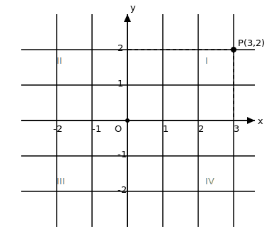

# §3.9 坐标几何

> **前置知识**：§2.10, §3.1
> **适用年级**：8 年级

## 平面直角坐标系

### 引入情境（Explore）

电影院里，你的座位票上写着" $5$ 排 $12$ 号"。这两个数字精确地确定了你在整个影厅中的位置。数学中也有类似的方法——用两个数来确定平面上一个点的位置。

### 概念建立（Build Understanding）

在平面上画两条互相垂直且有公共原点的数轴，就构成了**平面直角坐标系**（笛卡尔坐标系）。

- **水平的数轴**叫做 $x$ 轴（横轴），向右为正方向。
- **竖直的数轴**叫做 $y$ 轴（纵轴），向上为正方向。
- 两轴的交点 $O$ 叫做**原点**。

坐标系把平面分成四个**象限**：

| 象限 | $x$ 的符号 | $y$ 的符号 |
|------|-----------|-----------|
| 第一象限 | $+$ | $+$ |
| 第二象限 | $-$ | $+$ |
| 第三象限 | $-$ | $-$ |
| 第四象限 | $+$ | $-$ |

> 坐标轴上的点不属于任何象限。

### 典型例题（Worked Examples）

**例 1.** 判断下列点在哪个象限或坐标轴上： $A(3, 2)$ 、 $B(-1, 4)$ 、 $C(0, -5)$ 、 $D(-3, -2)$ 。

**解：**
$A(3, 2)$ ： $x > 0$ ， $y > 0$ ，第一象限。

$B(-1, 4)$ ： $x < 0$ ， $y > 0$ ，第二象限。

$C(0, -5)$ ： $x = 0$ ，在 $y$ 轴上（不属于任何象限）。

$D(-3, -2)$ ： $x < 0$ ， $y < 0$ ，第三象限。

**例 2.** 若点 $P(a, b)$ 在第四象限，则 $a$ 和 $b$ 分别满足什么条件？

**解：**
第四象限： $a > 0$ ， $b < 0$ 。

**例 3.** 若点 $P(m-1, m+2)$ 在 $y$ 轴上，求 $m$ 的值和点 $P$ 的坐标。

**解：**
在 $y$ 轴上的点横坐标为 $0$ ： $m - 1 = 0$ ， $m = 1$ 。

$P = (0, 3)$ 。

### 关键总结（Key Takeaways）

- 平面直角坐标系用有序数对 $(x, y)$ 表示点的位置。
- 四个象限由两条坐标轴划分，坐标轴上的点不属于任何象限。
- $x$ 轴上的点纵坐标为 $0$ ， $y$ 轴上的点横坐标为 $0$ 。

### 练一练（Practice）

1. 写出下列点所在的象限或坐标轴： $A(5, -3)$ 、 $B(-4, 0)$ 、 $C(-2, -7)$ 、 $D(0, 0)$ 。
2. 若点 $P(2a-4, a+1)$ 在第二象限，求 $a$ 的取值范围。

---

## 点的坐标

### 引入情境（Explore）

在方格纸上画一个坐标系，标出几个格点（格子的交叉点），读出它们的坐标——这就是"点的坐标"最基本的操作。反过来，给定坐标 $(3, -2)$ ，你能准确地在方格纸上找到这个点。

### 概念建立（Build Understanding）

**坐标的读取**：从点向 $x$ 轴作垂线，垂足在 $x$ 轴上的读数即为**横坐标**（ $x$ ）；从点向 $y$ 轴作垂线，垂足在 $y$ 轴上的读数即为**纵坐标**（ $y$ ）。

特殊点的坐标：
- 原点： $(0, 0)$
- $x$ 轴上的点： $(a, 0)$
- $y$ 轴上的点： $(0, b)$

**坐标与几何位置的关系**：
- 横坐标相同的两个点在同一条竖直线上。
- 纵坐标相同的两个点在同一条水平线上。

### 典型例题（Worked Examples）

**例 1.** 在坐标平面上画出 $A(2, 3)$ 、 $B(-1, 2)$ 、 $C(3, -1)$ 、 $D(-2, -3)$ ，并说明它们分别在哪个象限。

**解：**
$A(2, 3)$ ：从原点向右 $2$ 、向上 $3$ ，第一象限。

$B(-1, 2)$ ：从原点向左 $1$ 、向上 $2$ ，第二象限。

$C(3, -1)$ ：从原点向右 $3$ 、向下 $1$ ，第四象限。

$D(-2, -3)$ ：从原点向左 $2$ 、向下 $3$ ，第三象限。

**例 2.** 已知 $A(-3, 0)$ 、 $B(0, 4)$ ，求线段 $AB$ 的长度。

**解：**
$AB = \sqrt{(-3-0)^2 + (0-4)^2} = \sqrt{9 + 16} = \sqrt{25} = 5$ 。

（距离公式将在后面正式学习，这里也可以看出 $\triangle AOB$ 是直角三角形，直角在原点，两直角边分别为 $3$ 和 $4$ ，斜边 $= 5$ 。）

**例 3.** 正方形 $ABCD$ 的顶点 $A(0,0)$ 、 $B(4,0)$ 。 $C$ 、 $D$ 在 $x$ 轴上方，求 $C$ 、 $D$ 的坐标。

**解：**
$AB = 4$ ，沿 $x$ 轴。正方形的边长 $= 4$ 。

$D$ 在 $A$ 正上方（或按逆时针方向）， $D = (0, 4)$ 。

$C$ 在 $B$ 正上方， $C = (4, 4)$ 。

### 关键总结（Key Takeaways）

- 坐标 $(x, y)$ ： $x$ 是横坐标， $y$ 是纵坐标。
- 坐标的本质是用数来描述位置。

### 练一练（Practice）

3. 在坐标平面上标出以下各点： $A(0, 4)$ 、 $B(3, 0)$ 、 $C(-2, 3)$ 、 $D(5, -2)$ 。
4. 等腰直角三角形 $OAB$ 中， $O$ 为原点， $A(6, 0)$ 。 $B$ 在 $y$ 轴正半轴上，求 $B$ 的坐标。

---

## 用坐标表示平移

### 引入情境（Explore）

电子游戏中，角色向右走 $3$ 步、向上跳 $2$ 步——角色的坐标就从 $(x, y)$ 变成了 $(x+3, y+2)$ 。平移在坐标中有非常简洁的表达。

### 概念建立（Build Understanding）

将图形向右平移 $a$ 个单位、向上平移 $b$ 个单位，则每个点的坐标变化为：

$$(x, y) \to (x + a, y + b)$$

向左平移 $a$ 个单位等同于 $a$ 取负值，向下平移 $b$ 个单位等同于 $b$ 取负值。

### 典型例题（Worked Examples）

**例 1.** $\triangle ABC$ 的顶点为 $A(1, 2)$ 、 $B(4, 1)$ 、 $C(3, 5)$ 。将三角形向左平移 $3$ 个单位、向下平移 $2$ 个单位，求新的顶点坐标。

**解：**
向左 $3$ ，向下 $2$ ： $(x, y) \to (x - 3, y - 2)$ 。

$A' = (1 - 3, 2 - 2) = (-2, 0)$

$B' = (4 - 3, 1 - 2) = (1, -1)$

$C' = (3 - 3, 5 - 2) = (0, 3)$

**例 2.** 点 $P(2, 5)$ 经平移后到达 $P'(-1, 3)$ 。求平移的向量（方向和距离）。

**解：**
水平移动： $-1 - 2 = -3$ （向左 $3$ ）。

竖直移动： $3 - 5 = -2$ （向下 $2$ ）。

同一次平移将 $Q(4, -1)$ 变换为 $Q'(4-3, -1-2) = (1, -3)$ 。

**例 3.** 直线 $y = 2x + 1$ 向上平移 $3$ 个单位后的方程是什么？

**解：**
向上平移 $3$ 个单位：用 $y - 3$ 代替 $y$ （或等价地， $y \to y - 3$ ）。

新方程： $y - 3 = 2x + 1$ ，即 $y = 2x + 4$ 。

### 关键总结（Key Takeaways）

- 平移在坐标中表现为坐标的加减： $(x, y) \to (x + a, y + b)$ 。
- 平移不改变图形形状和大小，也不改变直线的斜率。

### 练一练（Practice）

5. 点 $A(-3, 4)$ 向右平移 $5$ 、向下平移 $3$ 后的坐标。
6. 线段 $AB$ 中， $A(1, 2)$ 、 $B(5, 6)$ 。将 $AB$ 向右平移 $3$ 个单位后，新线段的两端点坐标是什么？新线段的长度与原来相比如何？

---

## 用坐标表示轴对称

### 引入情境（Explore）

镜子放在 $y$ 轴的位置，你站在 $(3, 2)$ ，你在镜中的像在哪里？答案是 $(-3, 2)$ ——横坐标变号，纵坐标不变。

### 概念建立（Build Understanding）

**关于 $x$ 轴对称**： $(x, y) \to (x, -y)$ （纵坐标变号）

**关于 $y$ 轴对称**： $(x, y) \to (-x, y)$ （横坐标变号）

**关于原点对称**： $(x, y) \to (-x, -y)$ （两个坐标都变号）

| 对称类型 | 坐标变换 | 什么变什么不变 |
|----------|---------|---------------|
| 关于 $x$ 轴 | $(x, y) \to (x, -y)$ | $x$ 不变， $y$ 变号 |
| 关于 $y$ 轴 | $(x, y) \to (-x, y)$ | $y$ 不变， $x$ 变号 |
| 关于原点 | $(x, y) \to (-x, -y)$ | $x$ 、 $y$ 都变号 |

### 典型例题（Worked Examples）

**例 1.** 点 $A(3, -4)$ 关于 $x$ 轴、 $y$ 轴、原点的对称点分别是什么？

**解：**
关于 $x$ 轴： $A_1 = (3, 4)$ 。

关于 $y$ 轴： $A_2 = (-3, -4)$ 。

关于原点： $A_3 = (-3, 4)$ 。

**例 2.** $\triangle ABC$ 的顶点为 $A(1, 3)$ 、 $B(4, 1)$ 、 $C(2, 5)$ 。写出 $\triangle ABC$ 关于 $x$ 轴对称后的顶点坐标。

**解：**
$A' = (1, -3)$ ， $B' = (4, -1)$ ， $C' = (2, -5)$ 。

**例 3.** 点 $P(a, b)$ 关于 $y$ 轴的对称点为 $Q$ ， $Q$ 关于 $x$ 轴的对称点为 $R$ 。求 $R$ 的坐标。 $R$ 与 $P$ 关于什么对称？

**解：**
$P(a, b) \xrightarrow{y\text{轴}} Q(-a, b) \xrightarrow{x\text{轴}} R(-a, -b)$ 。

$R(-a, -b)$ 就是 $P(a, b)$ 关于原点的对称点。

所以"先关于 $y$ 轴对称再关于 $x$ 轴对称"等价于"关于原点对称"。

### 关键总结（Key Takeaways）

- $x$ 轴对称变 $y$ ， $y$ 轴对称变 $x$ ，原点对称都变。
- 两次轴对称（ $x$ 轴 $+$ $y$ 轴） $=$ 一次中心对称（关于原点）。

### 练一练（Practice）

7. 点 $M(-5, 2)$ 关于 $x$ 轴的对称点是_____，关于 $y$ 轴的对称点是_____，关于原点的对称点是_____。
8. 直线 $y = x + 2$ 关于 $x$ 轴对称后的方程是什么？

---

## 两点之间的距离公式

### 引入情境（Explore）

两座城市在地图上的坐标分别是 $(2, 3)$ 和 $(5, 7)$ 。它们之间的"直线距离"是多少格？直觉告诉我们可以用勾股定理来算——水平差 $3$ 格、竖直差 $4$ 格，斜线距离就是 $5$ 格。

### 概念建立（Build Understanding）

**两点之间的距离公式**：

设 $A(x_1, y_1)$ 和 $B(x_2, y_2)$ ，则

$$AB = \sqrt{(x_2 - x_1)^2 + (y_2 - y_1)^2}$$

推导：过 $A$ 、 $B$ 分别作坐标轴的平行线，构成直角三角形。水平距离 $= \lvert x_2 - x_1 \rvert$ ，竖直距离 $= \lvert y_2 - y_1 \rvert$ 。由勾股定理：

$$AB = \sqrt{(x_2 - x_1)^2 + (y_2 - y_1)^2}$$

特例：原点 $O(0, 0)$ 到点 $P(x, y)$ 的距离： $OP = \sqrt{x^2 + y^2}$ 。

### 典型例题（Worked Examples）

**例 1.** 求 $A(1, 2)$ 与 $B(4, 6)$ 之间的距离。

**解：**
$AB = \sqrt{(4-1)^2 + (6-2)^2} = \sqrt{9 + 16} = \sqrt{25} = 5$ 。

**例 2.** 已知 $A(-1, 3)$ 、 $B(2, -1)$ ，求 $AB$ 的长度。

**解：**
$AB = \sqrt{(2-(-1))^2 + (-1-3)^2} = \sqrt{9 + 16} = \sqrt{25} = 5$ 。

**例 3.** 已知 $A(0, 0)$ 、 $B(6, 0)$ 、 $C(3, 4)$ 。证明 $\triangle ABC$ 是等腰三角形。

**解：**
$AB = \sqrt{(6-0)^2 + 0^2} = 6$ 。

$AC = \sqrt{3^2 + 4^2} = \sqrt{25} = 5$ 。

$BC = \sqrt{(6-3)^2 + (0-4)^2} = \sqrt{9 + 16} = 5$ 。

因为 $AC = BC = 5$ ，所以 $\triangle ABC$ 是等腰三角形。

**例 4.** 在 $x$ 轴上找一点 $P$ ，使 $PA = PB$ ，其中 $A(1, 3)$ 、 $B(5, 1)$ 。

**解：**
设 $P(x, 0)$ （在 $x$ 轴上）。

$PA = \sqrt{(x-1)^2 + 9}$ ， $PB = \sqrt{(x-5)^2 + 1}$ 。

由 $PA = PB$ ： $(x-1)^2 + 9 = (x-5)^2 + 1$ 。

$x^2 - 2x + 1 + 9 = x^2 - 10x + 25 + 1$

$-2x + 10 = -10x + 26$

$8x = 16$

$x = 2$

所以 $P(2, 0)$ 。

### 关键总结（Key Takeaways）

- 距离公式 $= \sqrt{(\Delta x)^2 + (\Delta y)^2}$ ，本质是勾股定理。
- 距离公式可以用于判断三角形类型、求线段长度等。

### 练一练（Practice）

9. 求 $A(-2, 1)$ 与 $B(4, -3)$ 之间的距离。
10. 已知 $A(0, 0)$ 、 $B(4, 3)$ 、 $C(0, 5)$ ，判断 $\triangle ABC$ 的形状（按边分类）。
11. 在 $y$ 轴上找一点 $P$ ，使 $P$ 到 $A(3, 4)$ 的距离为 $5$ 。

---

## 中点坐标公式

### 引入情境（Explore）

两个好朋友住在城市的不同地方，他们想找一个"正中间"的地方见面。在坐标地图上，这个"正中间"的位置就是两点的中点。

### 概念建立（Build Understanding）

**中点坐标公式**：

设 $A(x_1, y_1)$ 和 $B(x_2, y_2)$ 的中点为 $M$ ，则

$$M = \left(\frac{x_1 + x_2}{2}, \frac{y_1 + y_2}{2}\right)$$

理解：中点的横坐标是两端点横坐标的平均值，纵坐标是两端点纵坐标的平均值。

### 典型例题（Worked Examples）

**例 1.** 求 $A(2, 6)$ 与 $B(8, 4)$ 的中点坐标。

**解：**
$M = \left(\dfrac{2+8}{2}, \dfrac{6+4}{2}\right) = (5, 5)$ 。

**例 2.** 线段 $AB$ 的中点为 $M(3, -1)$ ， $A(1, 2)$ 。求 $B$ 的坐标。

**解：**
$\dfrac{1 + x_B}{2} = 3$ ， $x_B = 5$ 。

$\dfrac{2 + y_B}{2} = -1$ ， $y_B = -4$ 。

$B = (5, -4)$ 。

**例 3.** 平行四边形 $ABCD$ 的三个顶点为 $A(0, 0)$ 、 $B(4, 0)$ 、 $C(5, 3)$ 。求 $D$ 的坐标。

**解：**
平行四边形的对角线互相平分，所以 $AC$ 和 $BD$ 的中点相同。

$AC$ 的中点 $= \left(\dfrac{0+5}{2}, \dfrac{0+3}{2}\right) = \left(\dfrac{5}{2}, \dfrac{3}{2}\right)$ 。

$BD$ 的中点也是 $\left(\dfrac{5}{2}, \dfrac{3}{2}\right)$ ：

$\dfrac{4 + x_D}{2} = \dfrac{5}{2}$ ， $x_D = 1$ 。

$\dfrac{0 + y_D}{2} = \dfrac{3}{2}$ ， $y_D = 3$ 。

$D = (1, 3)$ 。

**例 4.** 已知 $\triangle ABC$ 的三个顶点为 $A(0, 6)$ 、 $B(-4, 0)$ 、 $C(4, 0)$ 。求 $BC$ 边上的中线 $AM$ 的长度。

**解：**
$M$ 是 $BC$ 的中点： $M = \left(\dfrac{-4+4}{2}, \dfrac{0+0}{2}\right) = (0, 0)$ 。

$AM = \sqrt{(0-0)^2 + (0-6)^2} = 6$ 。

### 关键总结（Key Takeaways）

- 中点坐标 $= \left(\dfrac{x_1+x_2}{2}, \dfrac{y_1+y_2}{2}\right)$ ，即两端点坐标的平均值。
- 中点公式常与距离公式配合使用。
- 利用对角线中点相同可求平行四边形的顶点。

### 练一练（Practice）

12. 求 $A(-3, 5)$ 与 $B(7, -1)$ 的中点坐标。
13. 线段 $AB$ 的中点为 $M(4, 3)$ ， $A(2, 7)$ ，求 $B$ 的坐标。
14. $\triangle ABC$ 中， $A(2, 4)$ 、 $B(6, 0)$ 、 $C(-2, -2)$ 。求三条中线的交点（重心）坐标。（提示：重心坐标 $= \left(\dfrac{x_A+x_B+x_C}{3}, \dfrac{y_A+y_B+y_C}{3}\right)$ 。）

---

## 参考答案

1. $A(5, -3)$ ：第四象限。 $B(-4, 0)$ ： $x$ 轴上（负半轴）。 $C(-2, -7)$ ：第三象限。 $D(0, 0)$ ：原点。

2. 在第二象限： $x < 0$ 且 $y > 0$ 。 $2a - 4 < 0$ ， $a < 2$ ； $a + 1 > 0$ ， $a > -1$ 。所以 $-1 < a < 2$ 。

3. 略（在坐标纸上标点即可）。

4. $OA = 6$ （沿 $x$ 轴），等腰直角三角形中 $OB = OA = 6$ ， $B$ 在 $y$ 轴正半轴上，所以 $B = (0, 6)$ 。

5. $(-3 + 5, 4 - 3) = (2, 1)$ 。

6. $A' = (1+3, 2) = (4, 2)$ ， $B' = (5+3, 6) = (8, 6)$ 。原线段长 $= \sqrt{16+16} = 4\sqrt{2}$ ，新线段长也为 $4\sqrt{2}$ （平移不改变长度）。

7. 关于 $x$ 轴： $(-5, -2)$ 。关于 $y$ 轴： $(5, 2)$ 。关于原点： $(5, -2)$ 。

8. 关于 $x$ 轴对称： $y \to -y$ 。原式 $y = x + 2$ 变为 $-y = x + 2$ ，即 $y = -x - 2$ 。

9. $AB = \sqrt{(4-(-2))^2 + (-3-1)^2} = \sqrt{36 + 16} = \sqrt{52} = 2\sqrt{13}$ 。

10. $AB = \sqrt{16+9} = 5$ ， $AC = \sqrt{0+25} = 5$ ， $BC = \sqrt{16+4} = \sqrt{20} = 2\sqrt{5}$ 。 $AB = AC = 5$ ，等腰三角形。

11. 设 $P(0, y)$ 。 $PA = \sqrt{9 + (y-4)^2} = 5$ 。 $9 + (y-4)^2 = 25$ ， $(y-4)^2 = 16$ ， $y - 4 = \pm 4$ 。 $y = 8$ 或 $y = 0$ 。两个点： $P(0, 8)$ 或 $P(0, 0)$ 。

12. $M = \left(\dfrac{-3+7}{2}, \dfrac{5+(-1)}{2}\right) = (2, 2)$ 。

13. $\dfrac{2+x_B}{2} = 4$ ， $x_B = 6$ 。 $\dfrac{7+y_B}{2} = 3$ ， $y_B = -1$ 。 $B = (6, -1)$ 。

14. 重心 $= \left(\dfrac{2+6+(-2)}{3}, \dfrac{4+0+(-2)}{3}\right) = \left(2, \dfrac{2}{3}\right)$ 。
