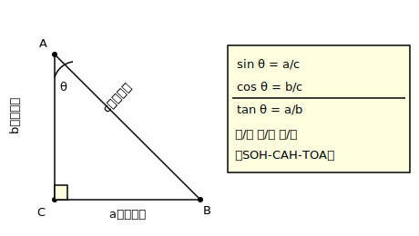
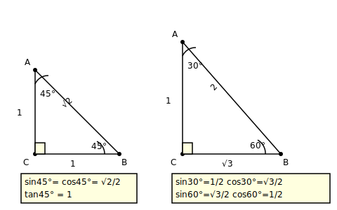
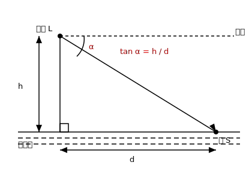

# §3.10 锐角三角函数

> **前置知识**：§3.4, §3.7
> **适用年级**：9 年级

## 锐角三角函数的定义

### 引入情境（Explore）

一座山的坡面与水平面的夹角是 $30°$。如果你沿着坡面走了 $100$ 米，你实际上升了多少米？

要回答这个问题，我们需要知道 $30°$ 角对应的"对边与斜边的比值"。这就是三角函数的核心思想——用比值来描述角与边的关系。

### 概念建立（Build Understanding）

在直角三角形中，设一个锐角为 $\angle A$，则：

$$\sin A = \frac{\text{对边}}{\text{斜边}} = \frac{a}{c}$$

$$\cos A = \frac{\text{邻边}}{\text{斜边}} = \frac{b}{c}$$

$$\tan A = \frac{\text{对边}}{\text{邻边}} = \frac{a}{b}$$

其中：
- **对边**：$\angle A$ 的对面那条边（$a$）
- **邻边**：$\angle A$ 的旁边那条直角边（$b$）
- **斜边**：直角的对面那条边，即最长的边（$c$）

> 记忆口诀："正弦 $=$ 对比斜，余弦 $=$ 邻比斜，正切 $=$ 对比邻。"

**为什么三角函数是确定的？**

在所有含 $\angle A$ 的直角三角形中，无论三角形的大小如何，$\sin A$、$\cos A$、$\tan A$ 的值都相同。这是因为这些直角三角形都是相似的（AA 相似：共同的 $\angle A$ 和 $90°$ 角），相似三角形的对应边成比例，因此比值不变。

### 典型例题（Worked Examples）

**例 1.** 如图，在 $Rt\triangle ABC$ 中，$\angle C = 90°$，$AC = 3$，$BC = 4$，$AB = 5$。求 $\sin A$、$\cos A$、$\tan A$。

**解：**
$\angle A$ 的对边 $= BC = 4$，邻边 $= AC = 3$，斜边 $= AB = 5$。

$\sin A = \dfrac{BC}{AB} = \dfrac{4}{5}$

$\cos A = \dfrac{AC}{AB} = \dfrac{3}{5}$

$\tan A = \dfrac{BC}{AC} = \dfrac{4}{3}$

**例 2.** 在 $Rt\triangle ABC$ 中，$\angle C = 90°$，$\sin A = \dfrac{5}{13}$。求 $\cos A$ 和 $\tan A$。

**解：**
设 $BC = 5k$，$AB = 13k$（$\sin A = \dfrac{BC}{AB} = \dfrac{5}{13}$）。

由勾股定理：$AC = \sqrt{AB^2 - BC^2} = \sqrt{169k^2 - 25k^2} = 12k$。

$\cos A = \dfrac{AC}{AB} = \dfrac{12k}{13k} = \dfrac{12}{13}$

$\tan A = \dfrac{BC}{AC} = \dfrac{5k}{12k} = \dfrac{5}{12}$

**例 3.** 在 $Rt\triangle ABC$ 中，$\angle C = 90°$，$\tan B = 2$，$BC = 6$。求 $AC$ 和 $AB$。

**解：**
$\tan B = \dfrac{AC}{BC} = \dfrac{AC}{6} = 2$，$AC = 12$。

$AB = \sqrt{BC^2 + AC^2} = \sqrt{36 + 144} = \sqrt{180} = 6\sqrt{5}$。

### 关键总结（Key Takeaways）

- $\sin A = \dfrac{\text{对边}}{\text{斜边}}$，$\cos A = \dfrac{\text{邻边}}{\text{斜边}}$，$\tan A = \dfrac{\text{对边}}{\text{邻边}}$。
- 三角函数值只取决于角度大小，与三角形的大小无关。
- 已知一个三角函数值和一条边，可以求出其他边。

### 练一练（Practice）

1. 在 $Rt\triangle ABC$ 中，$\angle C = 90°$，$AB = 10$，$AC = 8$。求 $\sin A$、$\cos A$、$\tan A$。
2. 在 $Rt\triangle ABC$ 中，$\angle C = 90°$，$\cos B = \dfrac{3}{5}$，$AB = 15$。求 $BC$ 和 $AC$。
3. 在 $Rt\triangle ABC$ 中，$\angle C = 90°$，$\tan A = \sqrt{3}$。求 $\angle A$（利用下一节的特殊角值）。

---

## 特殊角的三角函数值

### 引入情境（Explore）

虽然大多数角的三角函数值需要查表或用计算器，但有三个特殊角—— $30°$、$45°$、$60°$——的三角函数值可以精确计算出来，值得记住。

### 概念建立（Build Understanding）

**$45°$ 角**：等腰直角三角形中，两直角边相等。设直角边为 $1$，则斜边为 $\sqrt{2}$。

$$\sin 45° = \frac{1}{\sqrt{2}} = \frac{\sqrt{2}}{2}, \quad \cos 45° = \frac{\sqrt{2}}{2}, \quad \tan 45° = 1$$

**$30°$ 和 $60°$ 角**：将一个等边三角形沿高对折，得到含 $30°$ 和 $60°$ 角的直角三角形。设等边三角形边长为 $2$，则短直角边（$30°$ 对边）$= 1$，长直角边（$60°$ 对边）$= \sqrt{3}$，斜边 $= 2$。

$$\sin 30° = \frac{1}{2}, \quad \cos 30° = \frac{\sqrt{3}}{2}, \quad \tan 30° = \frac{1}{\sqrt{3}} = \frac{\sqrt{3}}{3}$$

$$\sin 60° = \frac{\sqrt{3}}{2}, \quad \cos 60° = \frac{1}{2}, \quad \tan 60° = \sqrt{3}$$

**特殊角三角函数值表**：

| 角度 | $\sin$ | $\cos$ | $\tan$ |
|------|--------|--------|--------|
| $30°$ | $\dfrac{1}{2}$ | $\dfrac{\sqrt{3}}{2}$ | $\dfrac{\sqrt{3}}{3}$ |
| $45°$ | $\dfrac{\sqrt{2}}{2}$ | $\dfrac{\sqrt{2}}{2}$ | $1$ |
| $60°$ | $\dfrac{\sqrt{3}}{2}$ | $\dfrac{1}{2}$ | $\sqrt{3}$ |

> 记忆技巧：$\sin$ 值从 $30°$ 到 $60°$ 依次增大：$\dfrac{1}{2} < \dfrac{\sqrt{2}}{2} < \dfrac{\sqrt{3}}{2}$。$\cos$ 值的变化恰好相反。

### 典型例题（Worked Examples）

**例 1.** 求 $\sin 30° + \cos 60°$ 的值。

**解：**
$\sin 30° + \cos 60° = \dfrac{1}{2} + \dfrac{1}{2} = 1$。

**例 2.** 求 $\sin^2 45° + \cos^2 45°$ 的值。

**解：**
$\sin^2 45° + \cos^2 45° = \left(\dfrac{\sqrt{2}}{2}\right)^2 + \left(\dfrac{\sqrt{2}}{2}\right)^2 = \dfrac{1}{2} + \dfrac{1}{2} = 1$。

**例 3.** 在 $Rt\triangle ABC$ 中，$\angle C = 90°$，$\angle A = 30°$，$AB = 10$。求 $BC$ 和 $AC$。

**解：**
$BC = AB \sin 30° = 10 \times \dfrac{1}{2} = 5$。

$AC = AB \cos 30° = 10 \times \dfrac{\sqrt{3}}{2} = 5\sqrt{3}$。

验证：$BC^2 + AC^2 = 25 + 75 = 100 = AB^2$。正确。

### 关键总结（Key Takeaways）

- $30°$、$45°$、$60°$ 的三角函数值是精确值，必须记住。
- $\sin$ 从 $30°$ 到 $60°$ 递增，$\cos$ 递减。
- $\tan 45° = 1$ 是一个重要的分界点。

### 练一练（Practice）

4. 计算 $2\sin 30° \times \cos 60° + \tan 45°$。
5. 在 $Rt\triangle ABC$ 中，$\angle C = 90°$，$\angle B = 60°$，$AC = 6$。求 $AB$ 和 $BC$。
6. 已知 $\sin \alpha = \dfrac{\sqrt{3}}{2}$，$\alpha$ 为锐角，求 $\alpha$。

---

## 三角函数之间的关系

### 引入情境（Explore）

观察特殊角的三角函数值表，你能发现一些规律吗？比如 $\sin 30° = \cos 60°$——一个角的正弦等于另一个角（它的余角）的余弦。这不是巧合！

### 概念建立（Build Understanding）

设直角三角形中两个锐角分别为 $\angle A$ 和 $\angle B$（$\angle A + \angle B = 90°$）。

**互余关系**：

$$\sin A = \cos B = \cos(90° - A)$$

$$\cos A = \sin B = \sin(90° - A)$$

即：一个锐角的正弦等于其余角的余弦，反之亦然。

> 这就是"余弦"名称的由来——"余角的正弦"。

**商的关系**：

$$\tan A = \frac{\sin A}{\cos A}$$

因为 $\tan A = \dfrac{a}{b}$，而 $\sin A = \dfrac{a}{c}$，$\cos A = \dfrac{b}{c}$，所以 $\dfrac{\sin A}{\cos A} = \dfrac{a/c}{b/c} = \dfrac{a}{b} = \tan A$。

**平方关系**：

$$\sin^2 A + \cos^2 A = 1$$

因为 $\sin^2 A + \cos^2 A = \dfrac{a^2}{c^2} + \dfrac{b^2}{c^2} = \dfrac{a^2 + b^2}{c^2} = \dfrac{c^2}{c^2} = 1$（勾股定理）。

### 典型例题（Worked Examples）

**例 1.** 已知 $\sin 28° \approx 0.469$，求 $\cos 62°$。

**解：**
因为 $28° + 62° = 90°$，所以 $\cos 62° = \sin 28° \approx 0.469$。

**例 2.** 已知 $\sin \alpha = \dfrac{3}{5}$（$\alpha$ 为锐角），求 $\cos \alpha$ 和 $\tan \alpha$。

**解：**
由 $\sin^2 \alpha + \cos^2 \alpha = 1$：

$\cos^2 \alpha = 1 - \sin^2 \alpha = 1 - \dfrac{9}{25} = \dfrac{16}{25}$。

因为 $\alpha$ 是锐角，$\cos \alpha > 0$，所以 $\cos \alpha = \dfrac{4}{5}$。

$\tan \alpha = \dfrac{\sin \alpha}{\cos \alpha} = \dfrac{3/5}{4/5} = \dfrac{3}{4}$。

**例 3.** 化简 $\dfrac{\sin 50°}{\cos 40°}$。

**解：**
$\cos 40° = \sin(90° - 40°) = \sin 50°$。

$\dfrac{\sin 50°}{\cos 40°} = \dfrac{\sin 50°}{\sin 50°} = 1$。

**例 4.** 化简 $\sin^2 25° + \sin^2 65°$。

**解：**
$\sin 65° = \cos 25°$（互余）。

$\sin^2 25° + \sin^2 65° = \sin^2 25° + \cos^2 25° = 1$。

### 关键总结（Key Takeaways）

- $\sin A = \cos(90° - A)$，$\cos A = \sin(90° - A)$。
- $\tan A = \dfrac{\sin A}{\cos A}$。
- $\sin^2 A + \cos^2 A = 1$。

### 练一练（Practice）

7. 已知 $\cos 35° \approx 0.819$，求 $\sin 55°$。
8. 已知 $\cos \alpha = \dfrac{5}{13}$，求 $\sin \alpha$ 和 $\tan \alpha$。
9. 化简 $\cos^2 40° + \cos^2 50°$。

---

## 解直角三角形

### 引入情境（Explore）

消防员要用云梯救人。已知窗户离地面 $12$ 米，云梯与地面的夹角不能超过 $60°$（否则不安全）。云梯至少需要多长？

这就是"解直角三角形"——已知直角三角形的部分边和角，求出其余的边和角。

### 概念建立（Build Understanding）

**解直角三角形**就是在直角三角形中，根据已知的边和角，求出所有未知的边和角。

在 $Rt\triangle ABC$（$\angle C = 90°$）中，已知条件至少包含**一条边**和**另一个元素**（一条边或一个锐角）。

常用关系：
- $\angle A + \angle B = 90°$
- $a^2 + b^2 = c^2$（勾股定理）
- $\sin A = \dfrac{a}{c}$，$\cos A = \dfrac{b}{c}$，$\tan A = \dfrac{a}{b}$

### 典型例题（Worked Examples）

**例 1.** 在 $Rt\triangle ABC$ 中，$\angle C = 90°$，$\angle A = 35°$，$c = 20$。求 $a$ 和 $b$。（$\sin 35° \approx 0.574$，$\cos 35° \approx 0.819$）

**解：**
$\angle B = 90° - 35° = 55°$。

$a = c \sin A = 20 \times 0.574 = 11.48$。

$b = c \cos A = 20 \times 0.819 = 16.38$。

验证：$a^2 + b^2 \approx 131.8 + 268.3 = 400.1 \approx 400 = c^2$。基本正确（误差来自近似值）。

**例 2.** 在 $Rt\triangle ABC$ 中，$\angle C = 90°$，$a = 5$，$b = 8$。求 $\angle A$ 和 $c$。

**解：**
$\tan A = \dfrac{a}{b} = \dfrac{5}{8} = 0.625$。

查表或用计算器得 $\angle A \approx 32°$。

$\angle B = 90° - 32° = 58°$。

$c = \sqrt{a^2 + b^2} = \sqrt{25 + 64} = \sqrt{89} \approx 9.43$。

**例 3.** 消防云梯问题：窗户离地面 $12$ m，云梯与地面的夹角为 $60°$。求云梯的长度和梯脚到墙壁的距离。

**解：**
设云梯长为 $l$，梯脚到墙壁的距离为 $d$。

$\sin 60° = \dfrac{12}{l}$，$\dfrac{\sqrt{3}}{2} = \dfrac{12}{l}$，$l = \dfrac{24}{\sqrt{3}} = \dfrac{24\sqrt{3}}{3} = 8\sqrt{3} \approx 13.86$ m。

$\cos 60° = \dfrac{d}{l}$，$d = l \cos 60° = 8\sqrt{3} \times \dfrac{1}{2} = 4\sqrt{3} \approx 6.93$ m。

或直接：$\tan 60° = \dfrac{12}{d}$，$d = \dfrac{12}{\sqrt{3}} = 4\sqrt{3}$ m。

### 关键总结（Key Takeaways）

- 解直角三角形需要至少两个已知量（其中至少一条边）。
- 根据已知和未知的组合，选择合适的三角函数关系。
- 解题时优先使用包含"一个已知量和一个未知量"的等式。

### 练一练（Practice）

10. 在 $Rt\triangle ABC$ 中，$\angle C = 90°$，$\angle A = 45°$，$a = 7$。求 $b$ 和 $c$。
11. 在 $Rt\triangle ABC$ 中，$\angle C = 90°$，$a = 8$，$c = 10$。求 $\angle A$、$\angle B$ 和 $b$。
12. 一根电线杆高 $10$ m，从杆顶向地面拉一根绳子，绳子与地面成 $30°$ 角。求绳子的长度和绳子固定点到杆底的距离。

---

## 应用：测量、坡度、仰角与俯角

### 引入情境（Explore）

古人没有飞机和卫星，却能测量金字塔的高度、河流的宽度。他们的秘密武器就是三角函数。今天，测量员、建筑师、飞行员依然在日常工作中使用三角函数。

### 概念建立（Build Understanding）

**仰角与俯角**：

从水平线向上看某个目标的角度叫做**仰角**（elevation angle）。

从水平线向下看某个目标的角度叫做**俯角**（depression angle）。

**坡度**：

坡面的铅直高度与水平距离的比叫做**坡度**（也叫坡比）。

$$\text{坡度} = \tan \alpha = \frac{\text{铅直高度}}{\text{水平距离}}$$

其中 $\alpha$ 是坡面与水平面的夹角（坡角）。

坡度常用比值或百分数表示：坡度 $1:2$ 表示水平前进 $2$ m 上升 $1$ m；坡度 $6\%$ 表示水平前进 $100$ m 上升 $6$ m。

### 典型例题（Worked Examples）

**例 1.** 小明站在距一栋楼 $50$ m 远的地面上，测得楼顶的仰角为 $45°$。小明的眼睛离地面 $1.5$ m。求楼的高度。

**解：**
设楼顶到小明眼睛水平线以上的高度为 $h$。

$\tan 45° = \dfrac{h}{50}$，$1 = \dfrac{h}{50}$，$h = 50$ m。

楼的高度 $= h + 1.5 = 50 + 1.5 = 51.5$ m。

**例 2.** 从山顶测得山脚处一棵树底部的俯角为 $60°$，树顶的俯角为 $45°$。山高 $100$ m。求树的高度。

**解：**
设山脚到树的水平距离为 $d$，树高为 $h$。

从山顶到树底部的俯角 $60°$：$\tan 60° = \dfrac{100}{d}$，$d = \dfrac{100}{\sqrt{3}} = \dfrac{100\sqrt{3}}{3}$ m。

从山顶到树顶的俯角 $45°$：$\tan 45° = \dfrac{100 - h}{d}$（树顶比山顶低 $100 - h$）。

$1 = \dfrac{100 - h}{\dfrac{100\sqrt{3}}{3}}$

$100 - h = \dfrac{100\sqrt{3}}{3}$

$h = 100 - \dfrac{100\sqrt{3}}{3} = \dfrac{300 - 100\sqrt{3}}{3} = \dfrac{100(3 - \sqrt{3})}{3} \approx \dfrac{100 \times 1.268}{3} \approx 42.3$ m。

**例 3.** 一段公路的坡度为 $1:5$，坡长 $200$ m。求这段公路的铅直高度和水平距离。

**解：**
坡度 $= \tan \alpha = \dfrac{1}{5}$。

设铅直高度为 $h$，水平距离为 $d$。$\dfrac{h}{d} = \dfrac{1}{5}$，$h = \dfrac{d}{5}$。

坡长（斜面长）$= \sqrt{h^2 + d^2} = 200$。

$\sqrt{\dfrac{d^2}{25} + d^2} = 200$

$\sqrt{\dfrac{26d^2}{25}} = 200$

$\dfrac{d\sqrt{26}}{5} = 200$

$d = \dfrac{1000}{\sqrt{26}} \approx 196.1$ m。

$h = \dfrac{d}{5} \approx 39.2$ m。

**例 4.** 要测量河对岸一棵树 $A$ 到河岸的距离。在河这边的岸上取两点 $B$、$C$，$BC = 100$ m，$\angle ABC = 90°$，$\angle ACB = 60°$。求 $AB$ 的长。

**解：**
在 $Rt\triangle ABC$（$\angle B = 90°$）中：

$\tan C = \dfrac{AB}{BC}$

$\tan 60° = \dfrac{AB}{100}$

$\sqrt{3} = \dfrac{AB}{100}$

$AB = 100\sqrt{3} \approx 173.2$ m。

### 关键总结（Key Takeaways）

- 仰角：向上看的角度；俯角：向下看的角度。
- 坡度 $= \tan(\text{坡角}) = \dfrac{\text{铅直高度}}{\text{水平距离}}$。
- 实际测量问题的关键：识别直角三角形，确定已知和未知元素。

### 练一练（Practice）

13. 小华站在距塔底 $30$ m 处，测得塔顶仰角为 $60°$。小华身高忽略不计，求塔高。
14. 一段坡路的坡角为 $30°$，沿坡面走了 $600$ m，实际升高了多少米？水平前进了多少米？
15. 飞机在 $1000$ m 高空飞行，飞行员看到前方地面目标的俯角为 $45°$。求飞机到目标的水平距离。
16. 在河岸一侧取 $B$、$C$ 两点，$BC = 80$ m，$\angle B = 90°$，测得对岸标志物 $A$ 使 $\angle ACB = 45°$。求 $AB$。

---

## 参考答案

1. $BC = \sqrt{AB^2 - AC^2} = \sqrt{100 - 64} = 6$。$\sin A = \dfrac{6}{10} = \dfrac{3}{5}$，$\cos A = \dfrac{8}{10} = \dfrac{4}{5}$，$\tan A = \dfrac{6}{8} = \dfrac{3}{4}$。

2. $\cos B = \dfrac{BC}{AB} = \dfrac{3}{5}$，$BC = AB \cos B = 15 \times \dfrac{3}{5} = 9$。$AC = \sqrt{AB^2 - BC^2} = \sqrt{225 - 81} = \sqrt{144} = 12$。

3. $\tan A = \sqrt{3} = \tan 60°$，所以 $\angle A = 60°$。

4. $2 \times \dfrac{1}{2} \times \dfrac{1}{2} + 1 = \dfrac{1}{2} + 1 = \dfrac{3}{2}$。

5. $\angle A = 90° - 60° = 30°$。$\tan B = \dfrac{AC}{BC}$，$\tan 60° = \dfrac{6}{BC}$，$BC = \dfrac{6}{\sqrt{3}} = 2\sqrt{3}$。$AB = \dfrac{AC}{\sin B} = \dfrac{6}{\sin 60°} = \dfrac{6}{\sqrt{3}/2} = 4\sqrt{3}$。

6. $\sin \alpha = \dfrac{\sqrt{3}}{2} = \sin 60°$，$\alpha = 60°$。

7. $\sin 55° = \cos 35° \approx 0.819$。

8. $\sin \alpha = \sqrt{1 - \cos^2 \alpha} = \sqrt{1 - \dfrac{25}{169}} = \sqrt{\dfrac{144}{169}} = \dfrac{12}{13}$。$\tan \alpha = \dfrac{12/13}{5/13} = \dfrac{12}{5}$。

9. $\cos^2 40° + \cos^2 50° = \cos^2 40° + \sin^2 40° = 1$（因为 $\cos 50° = \sin 40°$）。

10. $\angle B = 45°$。$\tan A = \dfrac{a}{b}$，$\tan 45° = \dfrac{7}{b}$，$b = 7$。$c = \sqrt{49 + 49} = 7\sqrt{2}$。

11. $b = \sqrt{c^2 - a^2} = \sqrt{100 - 64} = 6$。$\sin A = \dfrac{8}{10} = \dfrac{4}{5} = 0.8$，$\angle A \approx 53.13°$（或查表 $\angle A \approx 53°$）。$\angle B \approx 37°$。

12. $\sin 30° = \dfrac{10}{l}$，$l = \dfrac{10}{\sin 30°} = 20$ m。$d = 10 \times \dfrac{1}{\tan 30°} = 10\sqrt{3} \approx 17.32$ m。

13. $\tan 60° = \dfrac{h}{30}$，$h = 30\sqrt{3} \approx 51.96$ m。

14. 升高 $= 600 \times \sin 30° = 600 \times \dfrac{1}{2} = 300$ m。水平前进 $= 600 \times \cos 30° = 600 \times \dfrac{\sqrt{3}}{2} = 300\sqrt{3} \approx 519.6$ m。

15. $\tan 45° = \dfrac{1000}{d}$，$d = 1000$ m。

16. $\tan 45° = \dfrac{AB}{BC}$，$AB = BC \tan 45° = 80 \times 1 = 80$ m。
